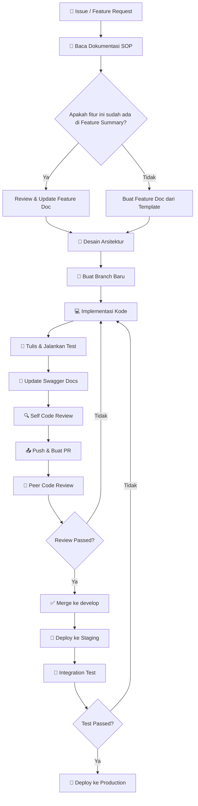

# SOP 01 — Development Workflow

> **Tujuan**: Memastikan setiap pengembangan fitur mengikuti alur kerja yang konsisten, terdokumentasi, dan dapat dilacak.

---

## 📋 Scope

SOP ini mencakup seluruh lifecycle pengembangan fitur dari ideasi hingga deployment.

---

## 🔄 Alur Kerja Pengembangan



---

## 📝 Langkah Detail

### 1. Persiapan (Pre-Development)

| # | Langkah | Checklist |
|---|---------|-----------|
| 1.1 | Baca SOP yang relevan | ☐ Code Standards, API Design, Testing |
| 1.2 | Review Feature Summary | ☐ Pastikan fitur belum ada / perlu diupdate |
| 1.3 | Buat/Update Feature Document | ☐ Gunakan template di `docs/features/feature-template.md` |
| 1.4 | Identifikasi dependencies | ☐ Layer mana yang terpengaruh? |
| 1.5 | Estimasi waktu | ☐ Breakdown per sub-task |

### 2. Branching

```bash
# Buat branch dari develop
git checkout develop
git pull origin develop
git checkout -b feature/<nama-fitur>

# Contoh:
git checkout -b feature/user-authentication
git checkout -b feature/product-crud
git checkout -b fix/cart-calculation-error
git checkout -b hotfix/payment-crash
```

**Naming Convention Branch:**
- `feature/<nama>` — Fitur baru
- `fix/<nama>` — Bug fix
- `hotfix/<nama>` — Fix kritis di production
- `refactor/<nama>` — Refactoring kode
- `docs/<nama>` — Perubahan dokumentasi saja

### 3. Implementasi

1. **Mulai dari Domain Layer** — Definisikan entity dan interface
2. **Lanjut ke Use Case Layer** — Implementasi business logic
3. **Kemudian Repository Layer** — Implementasi akses data
4. **Terakhir Handler/Delivery Layer** — Implementasi HTTP handler
5. **Update Swagger annotations** — Dokumentasikan endpoint baru

### 4. Testing

```bash
# Unit test
go test ./internal/... -v -cover

# Test specific package
go test ./internal/usecase/... -v

# Test dengan coverage report
go test ./... -coverprofile=coverage.out
go tool cover -html=coverage.out
```

### 5. Pre-Push Checklist

- [ ] Semua test passed
- [ ] Tidak ada linter error (`golangci-lint run`)
- [ ] Swagger docs sudah di-generate ulang (`swag init`)
- [ ] Kode sudah di-format (`gofmt -w .`)
- [ ] Tidak ada credential/secret di kode
- [ ] Feature document sudah diupdate
- [ ] Commit message mengikuti conventional commits

### 6. Pull Request

**Template PR:**
```markdown
## Deskripsi
[Jelaskan perubahan yang dilakukan]

## Tipe Perubahan
- [ ] Fitur Baru
- [ ] Bug Fix
- [ ] Refactoring
- [ ] Dokumentasi

## Checklist
- [ ] Unit tests ditulis & passed
- [ ] Swagger docs diupdate
- [ ] Feature doc diupdate
- [ ] Tidak ada breaking changes
- [ ] Code review sendiri sudah dilakukan

## Screenshots (jika relevan)
[Tambahkan screenshot]
```

---

## ⏰ Review Cycle

| Fase | Durasi Maksimum |
|------|-----------------|
| Code Review | 24 jam setelah PR dibuat |
| Revision | 12 jam setelah review |
| Final Approval | 6 jam setelah revision |

---

*Terakhir diperbarui: 2026-05-03*
