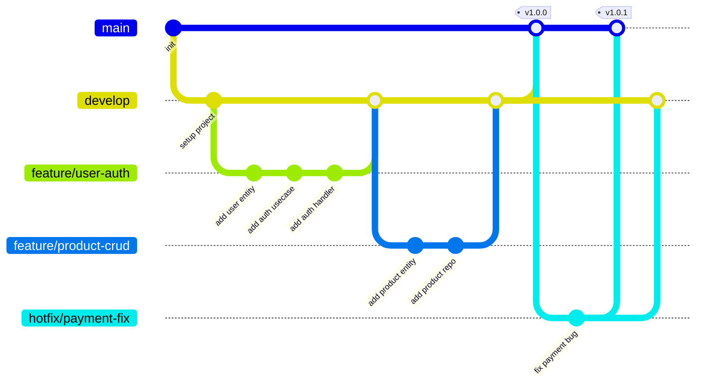

# SOP 03 — Git Branching Strategy

> **Tujuan**: Menjaga repository tetap terorganisir dengan strategi branching yang jelas dan predictable.

---

## 📋 Scope

SOP ini mengatur cara penggunaan Git, strategi branching, dan konvensi commit message.

---

## 🌳 Branch Model — Git Flow (Simplified)



---

## 🔀 Branch Types

| Branch | Asal | Merge ke | Keterangan |
|--------|------|----------|------------|
| `main` | — | — | Production-ready code. **NEVER commit langsung.** |
| `develop` | `main` | `main` | Integration branch. Semua fitur merge ke sini dulu. |
| `feature/*` | `develop` | `develop` | Fitur baru. 1 branch per 1 fitur. |
| `fix/*` | `develop` | `develop` | Bug fix non-kritis |
| `hotfix/*` | `main` | `main` + `develop` | Fix kritis di production |
| `refactor/*` | `develop` | `develop` | Refactoring tanpa perubahan behavior |
| `docs/*` | `develop` | `develop` | Perubahan dokumentasi saja |
| `release/*` | `develop` | `main` + `develop` | Persiapan release (version bump, dll) |

---

## 📝 Commit Message Convention

Menggunakan **Conventional Commits** specification:

```
<type>(<scope>): <description>

[optional body]

[optional footer(s)]
```

### Types

| Type | Deskripsi | Contoh |
|------|-----------|--------|
| `feat` | Fitur baru | `feat(auth): add JWT token generation` |
| `fix` | Bug fix | `fix(cart): correct total price calculation` |
| `refactor` | Refactoring kode | `refactor(user): extract validation logic` |
| `docs` | Perubahan dokumentasi | `docs(api): update swagger annotations` |
| `test` | Menambah/memperbaiki test | `test(order): add unit test for checkout` |
| `chore` | Maintenance tasks | `chore(deps): update mongo driver to v2` |
| `style` | Formatting (tidak ubah logic) | `style: run gofmt on all files` |
| `perf` | Performance improvement | `perf(product): add index for search query` |
| `ci` | CI/CD changes | `ci: add golangci-lint to pipeline` |

### Scopes (E-Commerce)

| Scope | Layer/Area |
|-------|-----------|
| `auth` | Authentication & Authorization |
| `user` | User management |
| `product` | Product catalog |
| `cart` | Shopping cart |
| `order` | Order management |
| `payment` | Payment processing |
| `shipping` | Shipping & delivery |
| `review` | Product reviews |
| `admin` | Admin panel |
| `middleware` | Middleware (CORS, logging, dll) |
| `config` | Configuration |
| `deps` | Dependencies |
| `db` | Database |

### Contoh Commit Messages

```bash
# ✅ BENAR
feat(auth): implement user registration with email verification
fix(cart): prevent negative quantity in cart items
refactor(order): extract order status validation to domain layer
docs(api): add swagger annotations for product endpoints
test(user): add unit tests for password hashing
chore(db): add MongoDB indexes for performance
perf(product): implement cursor-based pagination

# ❌ SALAH
update code
fixed bug
WIP
asdf
changes
```

---

## 🔒 Branch Protection Rules

### `main` branch:
- ❌ No direct push
- ✅ Requires PR with at least 1 approval
- ✅ Requires all checks to pass
- ✅ Requires linear history (squash merge)

### `develop` branch:
- ❌ No direct push
- ✅ Requires PR
- ✅ Requires all checks to pass

---

## 📋 Merge Strategy

```bash
# Feature → develop: Squash merge (clean history)
git checkout develop
git merge --squash feature/user-auth

# develop → main: Merge commit (preservasi milestone)
git checkout main
git merge develop --no-ff

# hotfix → main: Merge commit
git checkout main
git merge hotfix/payment-fix --no-ff
```

---

*Terakhir diperbarui: 2026-05-03*
