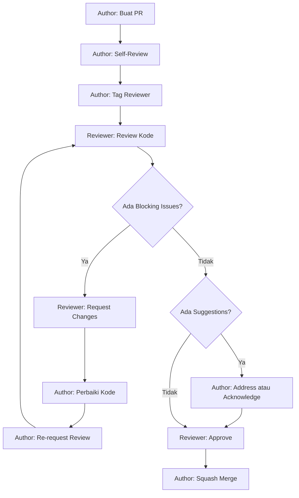

# SOP 04 — Code Review

> **Tujuan**: Menjaga kualitas kode melalui proses review yang terstruktur dan konstruktif.

---

## 📋 Scope

SOP ini mengatur proses code review, kriteria evaluasi, dan ekspektasi bagi reviewer dan author.

---

## 🔍 Review Checklist

### 1. Arsitektur & Clean Architecture Compliance

- [ ] **Layer Dependencies** — Apakah dependency hanya mengarah ke dalam (Handler → UseCase → Repository → Domain)?
- [ ] **Interface Segregation** — Apakah interface didefinisikan di domain layer, bukan di implementation layer?
- [ ] **Dependency Injection** — Apakah dependencies di-inject melalui constructor, bukan hardcoded?
- [ ] **No Business Logic in Handler** — Handler hanya decode request, panggil use case, encode response?
- [ ] **No Database Code in UseCase** — UseCase hanya berinteraksi dengan Repository interface?

### 2. Code Quality

- [ ] **Naming Convention** — Sesuai dengan SOP 02?
- [ ] **Error Handling** — Semua error di-handle, tidak ada `_` untuk error?
- [ ] **Context Propagation** — `context.Context` selalu dipropagasikan?
- [ ] **No Magic Numbers** — Semua angka "ajaib" sudah dijadikan constant?
- [ ] **DRY Principle** — Tidak ada duplikasi kode yang bisa di-extract?
- [ ] **Single Responsibility** — Setiap function/method punya satu tanggung jawab?

### 3. Security

- [ ] **Input Validation** — Semua input dari user divalidasi?
- [ ] **SQL/NoSQL Injection** — Query parameter di-sanitize/parameterized?
- [ ] **Authentication** — Endpoint yang butuh auth sudah dilindungi middleware?
- [ ] **Authorization** — Role-based access control sudah benar?
- [ ] **Sensitive Data** — Password tidak di-log, token tidak di-return di response yang salah?
- [ ] **CORS** — Konfigurasi CORS sudah benar?

### 4. Testing

- [ ] **Unit Tests** — Ada unit test untuk business logic baru?
- [ ] **Test Coverage** — Coverage >= 70% untuk use case layer?
- [ ] **Edge Cases** — Test mencakup edge case (nil, empty, invalid input)?
- [ ] **Mock Usage** — Repository di-mock untuk unit test, bukan pakai DB langsung?

### 5. Documentation

- [ ] **Swagger Annotations** — Handler baru punya Swagger annotations?
- [ ] **Code Comments** — Logic kompleks diberi komentar "why", bukan "what"?
- [ ] **Feature Doc** — Feature document sudah diupdate?

### 6. Performance

- [ ] **Database Queries** — Tidak ada N+1 query problem?
- [ ] **Pagination** — List endpoint menggunakan pagination?
- [ ] **Indexing** — Query field yang sering diakses sudah di-index?
- [ ] **Context Timeout** — Operasi database punya timeout?

---

## 👥 Roles & Responsibilities

### Author (Pembuat PR)

1. Self-review sebelum membuat PR
2. Tulis deskripsi PR yang jelas (gunakan template)
3. Tag reviewer yang relevan
4. Respond terhadap feedback dalam 12 jam
5. Jangan defensive — terima feedback sebagai learning

### Reviewer

1. Review dalam 24 jam setelah di-tag
2. Berikan feedback yang **konstruktif dan spesifik**
3. Bedakan antara **blocking** (harus diperbaiki) dan **nit** (saran perbaikan)
4. Approve jika semua blocking issues sudah resolved
5. Jangan nitpick hal yang bisa di-handle oleh linter

### Review Comment Format

```markdown
// 🔴 BLOCKING: [Penjelasan masalah dan saran perbaikan]
// Ini harus diperbaiki sebelum merge

// 🟡 SUGGESTION: [Saran perbaikan]
// Ini bisa diperbaiki sekarang atau di PR lain

// 🟢 NIT: [Minor improvement]
// Opsional, tidak blocking

// ❓ QUESTION: [Pertanyaan untuk klarifikasi]
// Butuh penjelasan sebelum approve
```

---

## 📊 Review Flow



---

## 📏 Quality Gates

| Metrik | Minimum | Target |
|--------|---------|--------|
| Unit Test Coverage (UseCase) | 70% | 85% |
| Unit Test Coverage (Repository) | 50% | 70% |
| Linter Errors | 0 | 0 |
| Swagger Docs Coverage | 100% endpoints | 100% |
| Max Function Length | 50 lines | 30 lines |
| Max File Length | 500 lines | 300 lines |
| Cyclomatic Complexity | <= 15 | <= 10 |

---

*Terakhir diperbarui: 2026-05-03*
