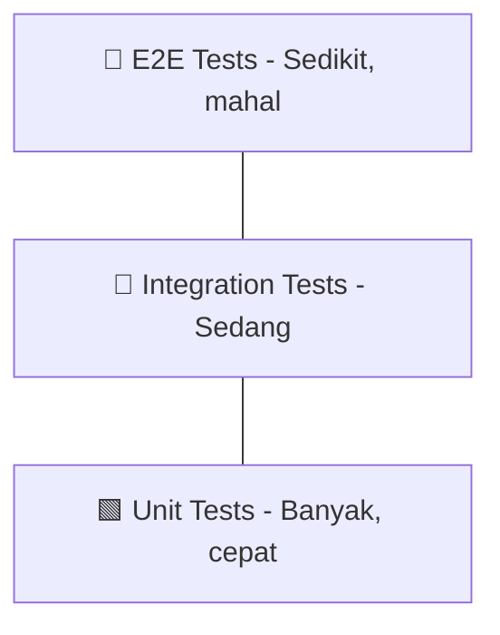

# SOP 05 — Testing Strategy

> **Tujuan**: Menjamin kualitas dan reliabilitas kode melalui testing yang terstruktur.

---

## 🏗️ Testing Pyramid



---

## 📝 Testing Per Layer

### 1. Domain Layer — Unit Test (Pure logic)

- Test entity validation, domain rules
- No mocks needed, pure functions
- Coverage target: **95%**

### 2. Use Case Layer — Unit Test + Mock

- Mock repository interfaces
- Test business logic orchestration
- Table-driven tests recommended
- Coverage target: **85%**

### 3. Repository Layer — Integration Test

- Use test database / testcontainers
- Tag dengan `//go:build integration`
- Coverage target: **70%**

### 4. Handler Layer — HTTP Test

- Gunakan `httptest` package
- Mock use case interfaces
- Test request/response serialization
- Coverage target: **80%**

---

## 📊 Coverage Requirements

| Layer | Minimum | Target |
|-------|---------|--------|
| Domain | 80% | 95% |
| UseCase | 70% | 85% |
| Repository | 50% | 70% |
| Handler | 60% | 80% |
| **Overall** | **65%** | **80%** |

---

## 🛠️ Test Commands

```bash
# Run semua unit tests
go test ./internal/... -v -count=1

# Run dengan coverage
go test ./internal/... -coverprofile=coverage.out
go tool cover -html=coverage.out -o coverage.html

# Run specific test
go test ./internal/usecase/... -run TestUserUseCase_Register -v

# Run integration tests
go test ./internal/repository/... -tags=integration -v

# Run test dengan race detector
go test ./internal/... -race -v
```

---

## 📏 Test Naming Convention

```
Pattern: Test<Struct>_<Method>/<scenario>

TestUserUseCase_Register/successful_registration
TestUserUseCase_Register/duplicate_email_error
TestUserRepository_FindByID/user_found
TestUserRepository_FindByID/user_not_found
```

---

## 🚫 Anti-Patterns

| Anti-Pattern | Solusi |
|--------------|-------|
| Test bergantung pada urutan | Setiap test harus independen |
| Akses DB langsung di unit test | Gunakan mock/interface |
| Test tanpa assertion | Selalu assert expected vs actual |
| Hardcoded test data | Gunakan test fixtures/builders |
| Terlalu banyak mock | Focus mock pada boundary layer |

---

*Terakhir diperbarui: 2026-05-03*
