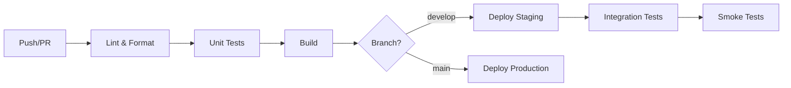

# SOP 07 — Deployment & CI/CD

> **Tujuan**: Menjamin proses deployment yang aman, repeatable, dan traceable.

---

## 🔄 CI/CD Pipeline



---

## 📋 Pipeline Stages

### 1. Lint & Format
```bash
gofmt -l .
golangci-lint run
swag fmt --dir ./internal/delivery/http/handler
```

### 2. Test
```bash
go test ./internal/... -v -race -coverprofile=coverage.out
```

### 3. Build
```bash
CGO_ENABLED=0 GOOS=linux go build -o ./bin/api ./cmd/api
```

### 4. Deploy
```bash
# Staging
docker build -t ecommerce-api:staging .
docker push registry/ecommerce-api:staging

# Production
docker build -t ecommerce-api:v$(git describe --tags) .
docker push registry/ecommerce-api:v$(git describe --tags)
```

---

## 📦 Dockerfile

```dockerfile
# Build stage
FROM golang:1.23-alpine AS builder
WORKDIR /app
COPY go.mod go.sum ./
RUN go mod download
COPY . .
RUN CGO_ENABLED=0 GOOS=linux go build -o /api ./cmd/api

# Production stage
FROM alpine:3.19
RUN apk --no-cache add ca-certificates tzdata
WORKDIR /app
COPY --from=builder /api .
EXPOSE 8080
CMD ["./api"]
```

---

## 🔐 Environment Variables

| Variable | Deskripsi | Required |
|----------|-----------|----------|
| `APP_ENV` | `development`, `staging`, `production` | ✅ |
| `APP_PORT` | Port server (default: 8080) | ❌ |
| `MONGODB_URI` | MongoDB Atlas connection string | ✅ |
| `MONGODB_DATABASE` | Nama database | ✅ |
| `JWT_SECRET` | Secret key untuk JWT | ✅ |
| `JWT_EXPIRATION` | Token expiration (default: 24h) | ❌ |
| `LOG_LEVEL` | `debug`, `info`, `warn`, `error` | ❌ |
| `CORS_ORIGINS` | Allowed CORS origins | ❌ |

> ⚠️ **JANGAN PERNAH** commit `.env` file ke repository. Gunakan `.env.example` sebagai template.

---

## 🚀 Release Checklist

- [ ] Semua tests passed (unit + integration)
- [ ] Swagger docs up to date
- [ ] Migration scripts ready (jika ada perubahan schema)
- [ ] Environment variables documented
- [ ] Changelog updated
- [ ] Version tag created
- [ ] Rollback plan documented

---

*Terakhir diperbarui: 2026-05-03*
