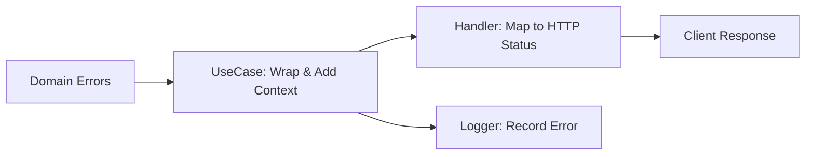

# SOP 08 — Error Handling & Logging

> **Tujuan**: Standarisasi penanganan error dan logging di seluruh application layers.

---

## 🏗️ Error Handling Architecture



---

## 📝 Domain Errors

```go
// internal/domain/errors.go
package domain

var (
    // Entity errors
    ErrUserNotFound     = errors.New("user not found")
    ErrProductNotFound  = errors.New("product not found")
    ErrOrderNotFound    = errors.New("order not found")
    
    // Validation errors
    ErrInvalidEmail     = errors.New("invalid email format")
    ErrInvalidInput     = errors.New("invalid input")
    ErrWeakPassword     = errors.New("password too weak")
    
    // Business logic errors
    ErrEmailExists      = errors.New("email already exists")
    ErrInsufficientStock = errors.New("insufficient stock")
    ErrCartEmpty        = errors.New("cart is empty")
    ErrUnauthorized     = errors.New("unauthorized")
    ErrForbidden        = errors.New("forbidden")
)
```

---

## 🔄 Error Wrapping Pattern

```go
// UseCase layer — wrap dengan context
func (uc *userUseCase) GetByID(ctx context.Context, id string) (*UserResponse, error) {
    user, err := uc.userRepo.FindByID(ctx, id)
    if err != nil {
        return nil, fmt.Errorf("userUseCase.GetByID: %w", err)
    }
    return toUserResponse(user), nil
}
```

---

## 🗺️ Error to HTTP Status Mapping

```go
// Handler layer — map domain error ke HTTP status
func mapErrorToStatus(err error) int {
    switch {
    case errors.Is(err, domain.ErrUserNotFound),
         errors.Is(err, domain.ErrProductNotFound):
        return http.StatusNotFound           // 404
    case errors.Is(err, domain.ErrInvalidInput),
         errors.Is(err, domain.ErrInvalidEmail):
        return http.StatusBadRequest         // 400
    case errors.Is(err, domain.ErrEmailExists):
        return http.StatusConflict           // 409
    case errors.Is(err, domain.ErrUnauthorized):
        return http.StatusUnauthorized       // 401
    case errors.Is(err, domain.ErrForbidden):
        return http.StatusForbidden          // 403
    case errors.Is(err, domain.ErrInsufficientStock):
        return http.StatusUnprocessableEntity // 422
    default:
        return http.StatusInternalServerError // 500
    }
}
```

---

## 📊 Logging Standards

### Log Levels

| Level | Kapan Digunakan | Contoh |
|-------|-----------------|--------|
| `DEBUG` | Detail untuk debugging | Query params, decoded payload |
| `INFO` | Event normal | Request received, user created |
| `WARN` | Potensi masalah | Deprecated API called, retry |
| `ERROR` | Error yang perlu perhatian | DB connection failed, 500 error |

### Rules

1. **JANGAN log sensitive data** — password, token, credit card
2. **Gunakan structured logging** — JSON format, bukan plain text
3. **Sertakan request ID** — Untuk tracing across layers
4. **Log di handler layer** — Bukan di domain atau repository
5. **Production = INFO+** — Debug level hanya di development

### Structured Log Format

```json
{
    "level": "error",
    "timestamp": "2026-05-03T14:30:00Z",
    "request_id": "req-abc123",
    "method": "POST",
    "path": "/api/v1/orders",
    "user_id": "user-789",
    "error": "insufficient stock for product prod-456",
    "duration_ms": 45
}
```

---

*Terakhir diperbarui: 2026-05-03*
