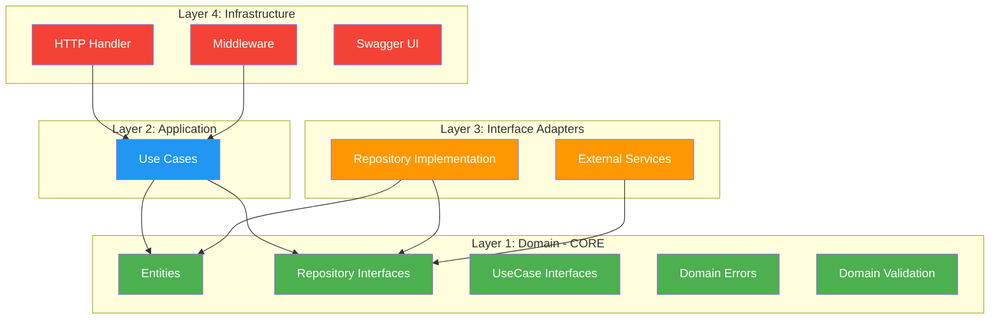
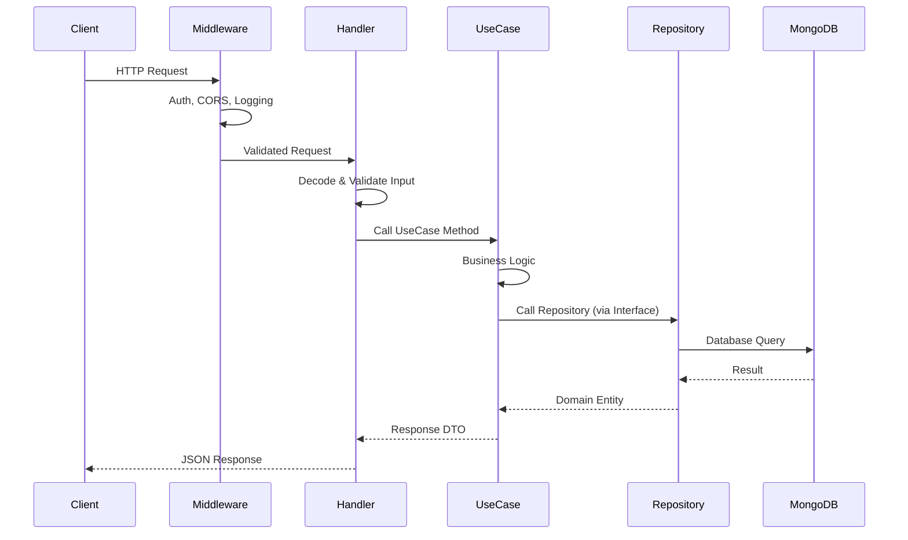
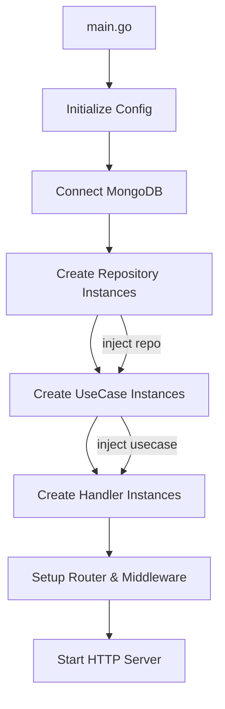

# Clean Architecture — E-Commerce Backend

> **Prinsip Utama**: Dependency hanya mengarah ke dalam. Layer luar bergantung pada layer dalam, TIDAK PERNAH sebaliknya.

---

## 🎯 Arsitektur Overview



---

## 📐 Layer Rules

| Layer | Boleh Import | Tidak Boleh Import |
|-------|-------------|-------------------|
| **Domain** | Standard library saja | UseCase, Repository impl, Handler, third-party DB |
| **UseCase** | Domain | Repository impl, Handler, HTTP library |
| **Repository** | Domain, DB driver | UseCase, Handler |
| **Handler** | Domain, UseCase interface | Repository impl, DB driver |

---

## 🔄 Request Flow



---

## 🏛️ Dependency Injection Flow



```go
// cmd/api/main.go — Dependency Injection
func main() {
    cfg := config.Load()
    db := mongodb.Connect(cfg.MongoURI)
    
    // Repository layer
    userRepo := mongoRepo.NewUserRepository(db)
    productRepo := mongoRepo.NewProductRepository(db)
    
    // UseCase layer — inject repository interfaces
    userUC := usecase.NewUserUseCase(userRepo, hasher, tokenGen)
    productUC := usecase.NewProductUseCase(productRepo)
    
    // Handler layer — inject usecase interfaces
    userHandler := handler.NewUserHandler(userUC)
    productHandler := handler.NewProductHandler(productUC)
    
    // Router
    router := http.NewServeMux()
    registerRoutes(router, userHandler, productHandler)
    
    http.ListenAndServe(":8080", router)
}
```

---

## 📏 Layer Violation Detector

Gunakan rules ini untuk mendeteksi pelanggaran arsitektur:

| Violation | Contoh | Perbaikan |
|-----------|--------|-----------|
| Handler import DB driver | `import "go.mongodb.org/..."` di handler | Gunakan UseCase interface |
| UseCase import HTTP | `import "net/http"` di usecase | Gunakan domain DTOs |
| Domain import third-party | `import "go.mongodb.org/..."` di domain | Hanya standard library |
| Repository berisi business logic | `if price > discount ...` di repo | Pindahkan ke UseCase |
| Handler berisi business logic | Validasi kompleks di handler | Pindahkan ke UseCase |

---

*Terakhir diperbarui: 2026-05-03*
