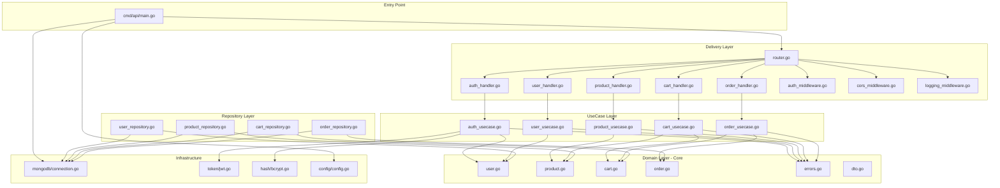
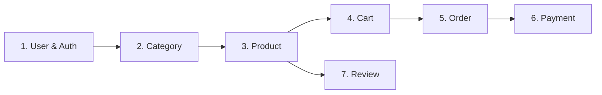

# Dependency Graph & AI Context

> **Tujuan**: Memberikan konteks arsitektur kepada AI assistant dan developer melalui dependency graph.

---

## 🔗 Dependency Graph



---

## 🤖 AI Context Guide

### Ketika AI merencanakan fitur baru, AI HARUS:

1. **Baca SOP terlebih dahulu** — `docs/SOP/` 
2. **Check Feature Summary** — `docs/features/feature-summary.md`
3. **Pahami Dependency Graph** — Diagram di atas
4. **Ikuti Clean Architecture** — `docs/architecture/clean-architecture.md`
5. **Gunakan Naming Convention** — `docs/SOP/02-code-standards.md`

### Context Map per Domain

| Domain | Depends On | Depended By |
|--------|-----------|-------------|
| **User** | - | Auth, Order, Review |
| **Product** | Category | Cart, Order, Review |
| **Category** | - | Product |
| **Cart** | Product, User | Order |
| **Order** | Cart, Product, User, Payment | - |
| **Payment** | Order | - |
| **Review** | Product, User, Order | Product (rating) |

### Urutan Implementasi Fitur (Recommended)



---

## 🔧 Tools untuk Generate Graph

```bash
# Install godepgraph
go install github.com/kisielk/godepgraph@latest

# Generate dependency graph
godepgraph -s ./cmd/api | dot -Tpng -o docs/dep-graph.png

# Install go-callvis untuk call graph
go install github.com/ofabry/go-callvis@latest
go-callvis -group pkg ./cmd/api
```

---

*Terakhir diperbarui: 2026-05-03*
