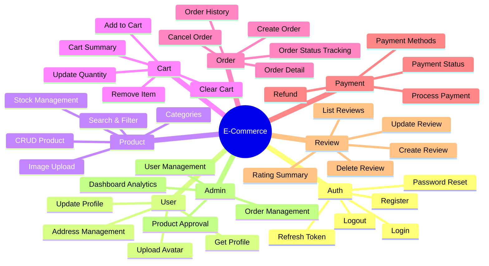
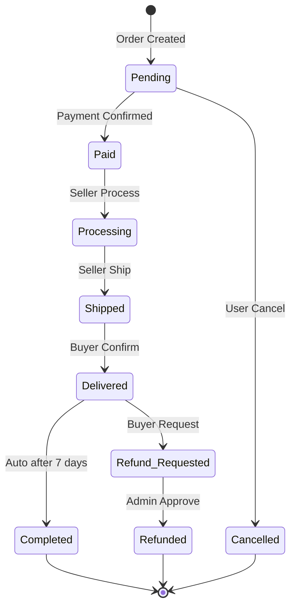

# 📋 Feature Summary — E-Commerce Backend

> **Ringkasan lengkap semua fitur yang direncanakan untuk platform E-Commerce.**

---

## 🗺️ Feature Map Overview

---

## 📊 Feature Details

### 🔐 1. Authentication & Authorization

| Fitur | Method | Endpoint | Status | Priority |
|-------|--------|----------|--------|----------|
| Register | POST | `/api/v1/auth/register` | 📋 Planned | 🔴 High |
| Login | POST | `/api/v1/auth/login` | 📋 Planned | 🔴 High |
| Refresh Token | POST | `/api/v1/auth/refresh` | 📋 Planned | 🔴 High |
| Logout | POST | `/api/v1/auth/logout` | 📋 Planned | 🟡 Medium |
| Forgot Password | POST | `/api/v1/auth/forgot-password` | 📋 Planned | 🟡 Medium |
| Reset Password | POST | `/api/v1/auth/reset-password` | 📋 Planned | 🟡 Medium |

**Business Rules:**
- Password minimum 8 karakter, harus ada uppercase, lowercase, angka
- JWT token expiration: 24 jam
- Refresh token expiration: 7 hari
- Rate limit login: 5 attempts per 15 menit

---

### 👤 2. User Management

| Fitur | Method | Endpoint | Status | Priority |
|-------|--------|----------|--------|----------|
| Get Profile | GET | `/api/v1/users/me` | 📋 Planned | 🔴 High |
| Update Profile | PUT | `/api/v1/users/me` | 📋 Planned | 🔴 High |
| Change Password | PUT | `/api/v1/users/me/password` | 📋 Planned | 🟡 Medium |
| Add Address | POST | `/api/v1/users/me/addresses` | 📋 Planned | 🟡 Medium |
| List Addresses | GET | `/api/v1/users/me/addresses` | 📋 Planned | 🟡 Medium |
| Delete Address | DELETE | `/api/v1/users/me/addresses/:id` | 📋 Planned | 🟡 Medium |

**Roles:**
- `customer` — Beli produk
- `seller` — Jual produk
- `admin` — Kelola platform

---

### 📦 3. Product Catalog

| Fitur | Method | Endpoint | Status | Priority |
|-------|--------|----------|--------|----------|
| List Products | GET | `/api/v1/products` | 📋 Planned | 🔴 High |
| Get Product | GET | `/api/v1/products/:id` | 📋 Planned | 🔴 High |
| Create Product | POST | `/api/v1/products` | 📋 Planned | 🔴 High |
| Update Product | PUT | `/api/v1/products/:id` | 📋 Planned | 🔴 High |
| Delete Product | DELETE | `/api/v1/products/:id` | 📋 Planned | 🟡 Medium |
| Search Products | GET | `/api/v1/products?q=keyword` | 📋 Planned | 🔴 High |
| List Categories | GET | `/api/v1/categories` | 📋 Planned | 🔴 High |
| Create Category | POST | `/api/v1/categories` | 📋 Planned | 🟡 Medium |

**Business Rules:**
- Hanya seller/admin yang bisa create/update/delete product
- Product harus punya minimal 1 gambar
- Stok tidak boleh negatif
- Pagination default: 20 items per page

---

### 🛒 4. Shopping Cart

| Fitur | Method | Endpoint | Status | Priority |
|-------|--------|----------|--------|----------|
| Get Cart | GET | `/api/v1/cart` | 📋 Planned | 🔴 High |
| Add to Cart | POST | `/api/v1/cart/items` | 📋 Planned | 🔴 High |
| Update Quantity | PUT | `/api/v1/cart/items/:id` | 📋 Planned | 🔴 High |
| Remove Item | DELETE | `/api/v1/cart/items/:id` | 📋 Planned | 🔴 High |
| Clear Cart | DELETE | `/api/v1/cart` | 📋 Planned | 🟡 Medium |

**Business Rules:**
- Quantity tidak boleh 0 atau negatif
- Check stok saat add to cart
- 1 user = 1 cart aktif
- Cart otomatis clear setelah checkout

---

### 📑 5. Order Management

| Fitur | Method | Endpoint | Status | Priority |
|-------|--------|----------|--------|----------|
| Create Order | POST | `/api/v1/orders` | 📋 Planned | 🔴 High |
| List Orders | GET | `/api/v1/orders` | 📋 Planned | 🔴 High |
| Get Order | GET | `/api/v1/orders/:id` | 📋 Planned | 🔴 High |
| Cancel Order | PUT | `/api/v1/orders/:id/cancel` | 📋 Planned | 🟡 Medium |
| Update Status | PUT | `/api/v1/orders/:id/status` | 📋 Planned | 🟡 Medium |

**Order Status Flow:**

---

### 💳 6. Payment

| Fitur | Method | Endpoint | Status | Priority |
|-------|--------|----------|--------|----------|
| Get Payment Methods | GET | `/api/v1/payments/methods` | 📋 Planned | 🟡 Medium |
| Process Payment | POST | `/api/v1/payments` | 📋 Planned | 🔴 High |
| Payment Status | GET | `/api/v1/payments/:id` | 📋 Planned | 🔴 High |
| Payment Callback | POST | `/api/v1/payments/callback` | 📋 Planned | 🔴 High |

---

### ⭐ 7. Reviews & Ratings

| Fitur | Method | Endpoint | Status | Priority |
|-------|--------|----------|--------|----------|
| Create Review | POST | `/api/v1/products/:id/reviews` | 📋 Planned | 🟡 Medium |
| List Reviews | GET | `/api/v1/products/:id/reviews` | 📋 Planned | 🟡 Medium |
| Update Review | PUT | `/api/v1/reviews/:id` | 📋 Planned | 🟢 Low |
| Delete Review | DELETE | `/api/v1/reviews/:id` | 📋 Planned | 🟢 Low |

**Business Rules:**
- Hanya bisa review setelah order status = Completed
- 1 user = 1 review per product
- Rating: 1-5 stars

---

### 🛡️ 8. Admin Panel

| Fitur | Method | Endpoint | Status | Priority |
|-------|--------|----------|--------|----------|
| List Users | GET | `/api/v1/admin/users` | 📋 Planned | 🟡 Medium |
| Ban User | PUT | `/api/v1/admin/users/:id/ban` | 📋 Planned | 🟢 Low |
| List All Orders | GET | `/api/v1/admin/orders` | 📋 Planned | 🟡 Medium |
| Dashboard Stats | GET | `/api/v1/admin/dashboard` | 📋 Planned | 🟢 Low |

---

## 📈 Status Legend

| Icon | Status |
|------|--------|
| 📋 | Planned — Belum dikerjakan |
| 🔨 | In Progress — Sedang dikerjakan |
| ✅ | Done — Selesai & tested |
| 🔴 | High Priority |
| 🟡 | Medium Priority |
| 🟢 | Low Priority |

---

*Terakhir diperbarui: 2026-05-03*
