# 🤖 PROMPT MASTER — Bootstrap GDGOC E-Commerce Full-Stack Project

> **TUJUAN FILE INI**: File ini adalah **prompt master lengkap** yang bisa kamu copy-paste ke AI agent lain (Antigravity, Cursor, Claude Code, Gemini Code Assist, dll) supaya AI tersebut bisa **mereplikasi seluruh struktur dokumentasi, skills, SOP, dan arsitektur** dari proyek `GDGOC E-Commerce Platform` ini secara **persis sama**.
>
> **CARA PAKAI**:
> 1. Buka folder kosong di tempat lain (proyek baru)
> 2. Copy SELURUH isi file ini ke prompt AI agent
> 3. AI akan otomatis membuat semua file & folder sesuai dengan blueprint di bawah
> 4. Hasilnya: struktur proyek 100% identik dengan proyek sumber
>
> **Bahasa default**: Bahasa Indonesia (semua docs, instruksi, dan komunikasi)

---

# ============================================================
# BAGIAN 1 — INSTRUKSI UTAMA UNTUK AI AGENT
# ============================================================

## 🎯 Misi Kamu (AI Agent)

Halo AI Agent! Kamu sedang ditugaskan untuk **bootstrap sebuah proyek full-stack E-Commerce baru** dengan struktur dokumentasi dan skills yang sangat ketat. Proyek ini adalah project Study Jam GDGOC UIN Maulana Malik Ibrahim Malang 2026.

Kamu **WAJIB** mengikuti instruksi di bawah ini secara berurutan dan **TANPA SKIP STEP MANAPUN**. Hasil akhir harus **identik** dengan blueprint yang diberikan.

## ⚙️ Stack Proyek (FIXED — JANGAN UBAH)

| Komponen | Teknologi | Catatan |
|----------|-----------|---------|
| Backend Language | **Go (Golang)** | Pure `net/http`, TANPA framework berat (bukan Gin, Echo, Fiber) |
| Database | **MongoDB Atlas** | Cloud, bukan local |
| DB Driver | **Official MongoDB Go Driver** (`go.mongodb.org/mongo-driver`) | ⚠️ JANGAN gunakan Prisma Go (sudah deprecated 2025) |
| API Docs | **Swagger via Swaggo** (`github.com/swaggo/swag`) | Generate dari annotations |
| Auth | **JWT + bcrypt** | Tidak ada session-based auth |
| Frontend | **React via Vite** | JavaScript / TypeScript |
| Frontend Styling | **Tailwind CSS / CSS Modules** | Pilih sesuai kebutuhan |
| Frontend HTTP | **Axios / Fetch API** | |
| Frontend Routing | **React Router** | |
| Frontend State | **React Context / Zustand** | |
| Backend Lint | **golangci-lint** | |
| Frontend Lint | **ESLint + Prettier** | |
| Arsitektur Backend | **Clean Architecture (4-Layer)** | Domain → UseCase → Repository → Handler |

## 🚫 LARANGAN MUTLAK

1. ❌ JANGAN gunakan framework Go berat (Gin, Echo, Fiber, Chi). HARUS pure `net/http`.
2. ❌ JANGAN gunakan Prisma Client Go (sudah archived sejak 2025).
3. ❌ JANGAN tambah/skip dokumen yang ada di blueprint. Buat **persis sama**.
4. ❌ JANGAN ubah naming, urutan section, atau struktur folder.
5. ❌ JANGAN translate ke bahasa lain. Semua harus tetap **Bahasa Indonesia**.
6. ❌ JANGAN tambahkan emoji yang tidak ada di blueprint asli.
7. ❌ JANGAN buat backend code (Go files) dan frontend code (React files) — di tahap ini HANYA buat dokumentasi, skills, AGENTS.md, README, dan config files. Backend & frontend code akan dibuat user nanti mengikuti SOP.

## ✅ URUTAN EKSEKUSI (WAJIB BERURUTAN)

```
Step 1  → Buat root files (.gitignore, AGENTS.md, README.md, LICENSE)
Step 2  → Buat folder docs/ dengan semua sub-folder
Step 3  → Buat docs/README.md (Documentation Hub)
Step 4  → Buat docs/SOP/ (8 file SOP)
Step 5  → Buat docs/architecture/ (3 file architecture)
Step 6  → Buat docs/features/ (feature-summary.md + feature-template.md)
Step 7  → Buat docs/api/ (endpoints.md + swagger-guide.md)
Step 8  → Buat docs/todo/master-todo.md
Step 9  → Buat folder .agents/skills/ dengan 8 skill folder
Step 10 → Buat masing-masing SKILL.md di setiap skill folder
Step 11 → Validasi semua file sudah dibuat (cek dengan list directory)
Step 12 → Lapor ke user dengan ringkasan singkat
```

## 📁 STRUKTUR FOLDER FINAL YANG HARUS DIHASILKAN

```
<project-root>/
│
├── .agents/
│   └── skills/
│       ├── code-review/SKILL.md
│       ├── create-endpoint/SKILL.md
│       ├── create-feature/SKILL.md
│       ├── debug-issue/SKILL.md
│       ├── error-handling/SKILL.md
│       ├── mongodb-repository/SKILL.md
│       ├── read-sop/SKILL.md
│       └── write-tests/SKILL.md
│
├── docs/
│   ├── README.md
│   ├── SOP/
│   │   ├── 01-development-workflow.md
│   │   ├── 02-code-standards.md
│   │   ├── 03-git-branching-strategy.md
│   │   ├── 04-code-review.md
│   │   ├── 05-testing-strategy.md
│   │   ├── 06-api-design.md
│   │   ├── 07-deployment.md
│   │   └── 08-error-handling.md
│   ├── architecture/
│   │   ├── clean-architecture.md
│   │   ├── project-structure.md
│   │   └── dependency-graph.md
│   ├── features/
│   │   ├── feature-summary.md
│   │   └── feature-template.md
│   ├── api/
│   │   ├── endpoints.md
│   │   └── swagger-guide.md
│   └── todo/
│       └── master-todo.md
│
├── .gitignore
├── AGENTS.md
├── LICENSE
└── README.md
```

> ⚠️ **CATATAN**: Folder `backend/` dan `frontend/` BELUM dibuat di tahap ini. Itu akan dibuat oleh user nanti mengikuti SOP. Tugas kamu sekarang HANYA membuat blueprint dokumentasi dan skills.

---

# ============================================================
# BAGIAN 2 — KONTEN PERSIS SETIAP FILE (COPY EXACTLY)
# ============================================================

> ⚠️ **PENTING**: Setiap blok di bawah ini bertanda dengan delimiter `===== FILE: <path> =====` di awal dan `===== END FILE =====` di akhir. Buat file dengan **isi persis** yang ada di antara dua delimiter tersebut. JANGAN tambah, JANGAN kurangi, JANGAN ubah formatting (whitespace, tabel, emoji).

---

## 📄 FILE 1 — `.gitignore`

```
===== FILE: .gitignore =====
# Binaries
*.exe
*.exe~
*.dll
*.so
*.dylib

# Go
/vendor/
/bin/
*.out

# Node / Frontend
node_modules/
dist/
build/
.cache/

# Environment
.env
.env.local
.env.*.local

# IDE
.idea/
.vscode/
*.swp
*.swo

# OS
.DS_Store
Thumbs.db

# Swagger generated
/docs/swagger/swagger.json
/docs/swagger/swagger.yaml

# Test
coverage.out
coverage.html

# Code Review Graph
.code-review-graph/

# Temporary
tmp/
===== END FILE =====
```

---

## 📄 FILE 2 — `LICENSE`

```
===== FILE: LICENSE =====
MIT License

Copyright (c) 2026 GDGOC UIN Maulana Malik Ibrahim Malang — Study Jam E-Commerce Team

Permission is hereby granted, free of charge, to any person obtaining a copy
of this software and associated documentation files (the "Software"), to deal
in the Software without restriction, including without limitation the rights
to use, copy, modify, merge, publish, distribute, sublicense, and/or sell
copies of the Software, and to permit persons to whom the Software is
furnished to do so, subject to the following conditions:

The above copyright notice and this permission notice shall be included in all
copies or substantial portions of the Software.

THE SOFTWARE IS PROVIDED "AS IS", WITHOUT WARRANTY OF ANY KIND, EXPRESS OR
IMPLIED, INCLUDING BUT NOT LIMITED TO THE WARRANTIES OF MERCHANTABILITY,
FITNESS FOR A PARTICULAR PURPOSE AND NONINFRINGEMENT. IN NO EVENT SHALL THE
AUTHORS OR COPYRIGHT HOLDERS BE LIABLE FOR ANY CLAIM, DAMAGES OR OTHER
LIABILITY, WHETHER IN AN ACTION OF CONTRACT, TORT OR OTHERWISE, ARISING FROM,
OUT OF OR IN CONNECTION WITH THE SOFTWARE OR THE USE OR OTHER DEALINGS IN THE
SOFTWARE.
===== END FILE =====
```

---

## 📄 FILE 3 — `AGENTS.md`

````
===== FILE: AGENTS.md =====
# E-Commerce Full-Stack — AI Agent Instructions

> **MANDATORY**: File ini otomatis dibaca oleh AI agent di setiap conversation.
> Semua aturan di sini WAJIB dipatuhi tanpa pengecualian.

---

## 🤖 Identitas Proyek

- **Nama**: GDGOC E-Commerce Platform
- **Tipe**: Full-Stack (Backend + Frontend)
- **Backend**: Go (Golang) — Pure `net/http`, tanpa framework berat
- **Frontend**: React (Vite)
- **Database**: MongoDB Atlas
- **DB Driver**: Official MongoDB Go Driver (`go.mongodb.org/mongo-driver`)
- **API Docs**: Swagger via Swaggo (`github.com/swaggo/swag`)
- **AI Context**: Code Review Graph (MCP-based)
- **Arsitektur**: Clean Architecture (4-Layer) untuk Backend

---

## 📖 WAJIB BACA SEBELUM PLANNING

Setiap kali merencanakan atau mengimplementasikan fitur, **WAJIB** baca:

1. `docs/SOP/01-development-workflow.md` — Alur kerja
2. `docs/SOP/02-code-standards.md` — Naming convention & code style
3. `docs/SOP/06-api-design.md` — Standar API design
4. `docs/SOP/08-error-handling.md` — Error handling patterns
5. `docs/architecture/clean-architecture.md` — Layer rules
6. `docs/architecture/project-structure.md` — Folder structure
7. `docs/architecture/dependency-graph.md` — Dependency graph
8. `docs/features/feature-summary.md` — Cek fitur yang sudah ada
9. `docs/api/endpoints.md` — Cek endpoint yang sudah didefinisikan
10. `docs/todo/master-todo.md` — Cek progress saat ini

### Skills yang Tersedia

Gunakan skills di `.agents/skills/` sesuai konteks:

| Skill | Kapan Digunakan |
|-------|-----------------|
| `read-sop` | Awal setiap sesi planning/coding |
| `create-feature` | Membuat fitur baru end-to-end |
| `create-endpoint` | Menambah endpoint API baru |
| `mongodb-repository` | Membuat repository MongoDB |
| `write-tests` | Menulis unit/integration test |
| `error-handling` | Implementasi error handling |
| `code-review` | Review kode sebelum merge |
| `debug-issue` | Debugging & troubleshooting |

---

## 🏗️ Tech Stack Detail

### Backend (Go)

| Komponen | Teknologi |
|----------|-----------|
| Language | Go (Golang) — Pure `net/http` |
| Database | MongoDB Atlas |
| DB Driver | Official MongoDB Go Driver |
| API Docs | Swagger (Swaggo) |
| Auth | JWT + bcrypt |
| Linting | golangci-lint |
| Formatting | gofmt, goimports |

### Frontend (React)

| Komponen | Teknologi |
|----------|-----------|
| Framework | React (via Vite) |
| Language | JavaScript / TypeScript |
| Styling | CSS Modules / Tailwind CSS |
| HTTP Client | Axios / Fetch API |
| Routing | React Router |
| State | React Context / Zustand |
| Linting | ESLint |
| Formatting | Prettier |

---

## 🏛️ Aturan Clean Architecture (Backend)

### Layer Structure (Dalam → Luar)

```
1. Domain    → Entity, Interface, Errors (ZERO dependency)
2. UseCase   → Business logic (import: domain only)
3. Repository → Data access (import: domain, db driver)
4. Handler    → HTTP delivery (import: domain, usecase interface)
```

### Dependency Rules

- ✅ Handler → UseCase Interface → Repository Interface ← Repository Implementation
- ❌ JANGAN import layer luar dari layer dalam
- ❌ JANGAN import concrete implementation, selalu gunakan interface
- ❌ JANGAN taruh business logic di handler atau repository
- ❌ JANGAN import `net/http` di usecase layer
- ❌ JANGAN import `mongo-driver` di domain layer

---

## ⚛️ Aturan Frontend (React)

### Struktur Folder Frontend

```
frontend/src/
├── components/     → Reusable UI components
├── pages/          → Page-level components (route targets)
├── hooks/          → Custom React hooks
├── services/       → API service layer (Axios/Fetch calls)
├── context/        → React Context providers
├── utils/          → Utility / helper functions
├── styles/         → Global CSS / theme
├── App.jsx         → Root component
└── main.jsx        → Entry point
```

### Frontend Rules

- ✅ Pisahkan logic API ke folder `services/`
- ✅ Gunakan custom hooks untuk reusable logic
- ✅ Komponen harus modular dan reusable
- ✅ Gunakan React Router untuk navigasi
- ❌ JANGAN taruh API call langsung di component — gunakan services
- ❌ JANGAN hardcode API URL — gunakan environment variable (`VITE_API_URL`)
- ❌ JANGAN gunakan inline styles untuk styling utama

---

## 📝 Urutan Implementasi Fitur Baru

Ketika membuat fitur baru, **SELALU** ikuti urutan ini:

### Backend
```
1. Buat Feature Document (dari template docs/features/feature-template.md)
2. Domain Layer    → Entity struct + Repository interface + Errors
3. UseCase Layer   → Business logic implementation
4. Repository Layer → MongoDB implementation
5. Handler Layer   → HTTP handler + Swagger annotations
6. Tests          → Unit test per layer
7. Update docs    → Feature summary, endpoints, todo list
```

### Frontend
```
1. Buat service function di services/ (API call)
2. Buat custom hook di hooks/ (jika perlu)
3. Buat komponen di components/ (reusable UI)
4. Buat page di pages/ (route target)
5. Update routing di App.jsx
6. Test UI & API integration
```

---

## 📏 Code Standards Checklist

### Backend (Go)
- [ ] File names: `snake_case.go`
- [ ] Package names: lowercase, singular
- [ ] Variables: camelCase
- [ ] Exported: PascalCase
- [ ] Interfaces: `[Entity]Repository`, `[Entity]UseCase`
- [ ] Error handling: selalu handle, gunakan `fmt.Errorf("context: %w", err)`
- [ ] Context: selalu propagate `context.Context`
- [ ] Imports: grouped (stdlib / third-party / internal)
- [ ] Struct init: named fields only
- [ ] Swagger annotations: setiap handler endpoint

### Frontend (React)
- [ ] Component names: PascalCase (`ProductCard.jsx`)
- [ ] Hook names: camelCase dengan prefix `use` (`useProducts.js`)
- [ ] Service names: camelCase (`productService.js`)
- [ ] CSS modules: camelCase (`productCard.module.css`)
- [ ] Props: destructured di parameter
- [ ] API calls: hanya di services/ folder
- [ ] Environment vars: prefix `VITE_`

---

## 📦 Standard Response Format

```json
// Success
{
    "success": true,
    "message": "...",
    "data": { ... }
}

// Success List (paginated)
{
    "success": true,
    "message": "...",
    "data": [ ... ],
    "meta": { "page": 1, "per_page": 20, "total": 100, "total_pages": 5 }
}

// Error
{
    "success": false,
    "message": "...",
    "error": { "code": "ERROR_CODE", "details": [ ... ] }
}
```

---

## 🚫 JANGAN PERNAH

### Backend
1. Commit `.env` atau credentials ke repository
2. Skip error handling (jangan pakai `_` untuk error)
3. Buat context baru di tengah chain (`context.Background()` di usecase)
4. Import concrete implementation di layer yang salah
5. Taruh business logic di handler
6. Buat endpoint tanpa Swagger annotation
7. Push tanpa menjalankan `go test` dan `golangci-lint`
8. Gunakan Prisma Go (sudah deprecated/archived sejak 2025)

### Frontend
1. Commit `node_modules/` atau `.env` ke repository
2. Taruh API call langsung di component (gunakan services/)
3. Hardcode API URL (gunakan `VITE_API_URL`)
4. Gunakan `any` type di TypeScript
5. Skip error handling pada API calls
6. Push tanpa lint check (`npm run lint`)

---

## 🔧 Key Commands

### Backend
```bash
cd backend
go run cmd/api/main.go        # Run server
go test ./internal/... -v      # Run tests
golangci-lint run              # Lint
swag init -g cmd/api/main.go   # Generate swagger
gofmt -w .                     # Format code
```

### Frontend
```bash
cd frontend
npm run dev                    # Run dev server
npm run build                  # Build production
npm run lint                   # Lint
npm run preview                # Preview production build
```

---

## 👥 Team

| Member | Role | GitHub |
|--------|------|--------|
| Sulthan Adam Rahmadi | Project Manager & Backend | [@Sadamdi](https://github.com/Sadamdi) |
| Villhze | Backend Developer | [@Villhze](https://github.com/Villhze) |
| Rahmat Rafii | Backend Developer | [@rahmatrafii](https://github.com/rahmatrafii) |
| M. Fahd Khulloh | UI/UX & Frontend | [@MFahdKhulloh-221](https://github.com/MFahdKhulloh-221) |

---

## ⚠️ Catatan Penting

### Prisma Go SUDAH DEPRECATED
Prisma Client Go telah di-archive pada 2025. Proyek ini menggunakan **Official MongoDB Go Driver** (`go.mongodb.org/mongo-driver`). Jangan pernah suggest atau gunakan Prisma Go.

### MongoDB Atlas
- Gunakan connection string dari environment variable `MONGODB_URI`
- Selalu gunakan context dengan timeout untuk operasi database
- Buat indexes untuk field yang sering di-query

### Frontend Environment
- API Base URL: `VITE_API_URL` (default: `http://localhost:8080/api/v1`)
- Jangan expose secret keys di frontend

---
===== END FILE =====
````

---

## 📄 FILE 4 — `README.md`

````
===== FILE: README.md =====
<p align="center">
  
</p>

<h1 align="center">🛒 GDGOC E-Commerce Platform</h1>

<p align="center">
  <strong>Study Jam 2026 — GDG On Campus UIN Maulana Malik Ibrahim Malang</strong>
</p>

<p align="center">
  Full-Stack E-Commerce Platform · Go Backend · React Frontend · MongoDB Atlas
</p>

<p align="center">
  <a href="#-tech-stack"></a>
  <a href="#-tech-stack"></a>
  <a href="#-tech-stack"></a>
  <a href="#-tech-stack"></a>
  <a href="#-tech-stack"></a>
  <a href="LICENSE"></a>
</p>

---

## 📖 About

**GDGOC E-Commerce** adalah proyek full-stack e-commerce platform yang dikembangkan sebagai bagian dari **Study Jam 2026** oleh **Google Developer Groups On Campus (GDGOC) UIN Maulana Malik Ibrahim Malang**.

Proyek ini menggabungkan backend Go murni (tanpa framework berat) dengan arsitektur Clean Architecture 4-Layer, dan frontend React modern untuk pengalaman pengguna yang interaktif. Seluruh tim berkolaborasi mengikuti SOP yang ketat dengan bantuan AI-powered Code Review Graph.

---

## 🚀 Tech Stack

### Backend

| Component | Technology |
|-----------|-----------|
| **Language** | Go (Golang) — Pure `net/http`, tanpa framework berat |
| **Database** | MongoDB Atlas (Cloud) |
| **DB Driver** | Official MongoDB Go Driver (`go.mongodb.org/mongo-driver`) |
| **API Docs** | Swagger via Swaggo (`github.com/swaggo/swag`) |
| **Architecture** | Clean Architecture (4-Layer) |
| **Auth** | JWT (JSON Web Tokens) + bcrypt |
| **Linting** | golangci-lint |
| **Formatting** | gofmt, goimports |

### Frontend

| Component | Technology |
|-----------|-----------|
| **Framework** | React (via Vite) |
| **Language** | JavaScript / TypeScript |
| **Styling** | CSS Modules / Tailwind CSS |
| **HTTP Client** | Axios / Fetch API |
| **Routing** | React Router |
| **State Management** | React Context / Zustand |
| **Linting** | ESLint |
| **Formatting** | Prettier |

### AI & DevOps

| Component | Technology |
|-----------|-----------|
| **AI Code Review** | [Code Review Graph](https://github.com/tirth8205/code-review-graph) (MCP-based) |
| **AI Assistant** | Claude / Gemini via MCP |
| **CI/CD** | GitHub Actions |

> ⚠️ **Note**: Prisma Client Go telah **di-archive** sejak 2025. Proyek ini menggunakan **Official MongoDB Go Driver** yang didukung penuh oleh MongoDB Inc.

---

## 🤖 Code Review Graph

Proyek ini menggunakan [**Code Review Graph**](https://github.com/tirth8205/code-review-graph) — sebuah local knowledge graph yang membangun peta struktural dari codebase menggunakan [Tree-sitter](https://tree-sitter.github.io/tree-sitter/). Tool ini terintegrasi dengan AI assistant via [MCP (Model Context Protocol)](https://modelcontextprotocol.io/) sehingga AI hanya membaca file yang relevan saat melakukan review.

### Kenapa Code Review Graph?

| Keunggulan | Penjelasan |
|------------|-----------|
| 🎯 **Blast-Radius Analysis** | Saat file berubah, graph melacak setiap caller, dependent, dan test yang terpengaruh — AI hanya baca file yang benar-benar terdampak |
| ⚡ **Incremental Updates** | Update graph dalam < 2 detik setiap kali commit atau save file |
| 🔍 **6.8× Fewer Tokens** | Mengurangi konsumsi token AI hingga 6.8× pada code review dan 49× pada daily coding tasks |
| 🌐 **23 Languages** | Full Tree-sitter support termasuk Go, JavaScript, TypeScript, dan banyak lagi |
| 📊 **Architecture Overview** | Visualisasi dependency graph, community detection, dan knowledge gaps |

### Setup

```bash
# Install
pip install code-review-graph

# Auto-detect & configure semua AI platforms
code-review-graph install

# Build graph pertama kali
code-review-graph build

# Setelah itu, graph auto-update di setiap commit/save
```

### MCP Tools yang Tersedia

Setelah graph di-build, AI assistant otomatis mendapat akses ke tools seperti:

- `build_or_update_graph_tool` — Build/update graph
- `get_review_context_tool` — Dapatkan konteks review yang minimal
- `get_impact_radius_tool` — Analisis blast radius perubahan
- `get_architecture_overview_tool` — Overview arsitektur codebase
- `semantic_search_nodes_tool` — Semantic search di graph
- `detect_changes_tool` — Deteksi perubahan dengan risk scoring

> 📖 Selengkapnya: [github.com/tirth8205/code-review-graph](https://github.com/tirth8205/code-review-graph)

---

## 🏛️ Architecture

Backend mengikuti **Clean Architecture** dengan 4 layer:

```
┌─────────────────────────────────────────────┐
│              Layer 4: Handler               │ ← HTTP Delivery (net/http)
├─────────────────────────────────────────────┤
│              Layer 3: Repository            │ ← Data Access (MongoDB)
├─────────────────────────────────────────────┤
│              Layer 2: UseCase               │ ← Business Logic
├─────────────────────────────────────────────┤
│              Layer 1: Domain                │ ← Entities, Interfaces, Errors
└─────────────────────────────────────────────┘
```

**Dependency Rule**: Dependencies hanya mengarah **ke dalam**. Layer luar bergantung pada layer dalam, **tidak pernah** sebaliknya.

---

## 📁 Project Structure

```
GDGOC-Ecommerce/
│
├── backend/                          # 🔧 Go Backend (API Server)
│   ├── cmd/api/
│   │   └── main.go                   # Entry point & Dependency Injection
│   ├── internal/
│   │   ├── config/                   # Configuration management
│   │   ├── domain/                   # 🟢 Layer 1: Entities & Interfaces
│   │   ├── usecase/                  # 🔵 Layer 2: Business Logic
│   │   ├── repository/mongo/         # 🟠 Layer 3: MongoDB Implementation
│   │   ├── delivery/http/            # 🔴 Layer 4: HTTP Handlers
│   │   │   ├── handler/
│   │   │   ├── middleware/
│   │   │   └── router/
│   │   └── pkg/                      # Shared utilities
│   ├── go.mod
│   └── go.sum
│
├── frontend/                         # ⚛️ React Frontend (Vite)
│   ├── public/
│   ├── src/
│   │   ├── components/               # Reusable UI components
│   │   ├── pages/                    # Page-level components
│   │   ├── hooks/                    # Custom React hooks
│   │   ├── services/                 # API service layer
│   │   ├── context/                  # React Context providers
│   │   ├── utils/                    # Utility functions
│   │   ├── styles/                   # Global styles & theme
│   │   ├── App.jsx
│   │   └── main.jsx
│   ├── package.json
│   └── vite.config.js
│
├── docs/                             # 📚 Documentation
│   ├── assets/                       # Logo & media assets
│   ├── SOP/                          # Standard Operating Procedures
│   ├── architecture/                 # Architecture documentation
│   ├── features/                     # Feature documentation
│   ├── api/                          # API documentation
│   └── todo/                         # To-do & progress tracking
│
├── .agents/                          # 🤖 AI Agent Skills
├── .gitignore
├── AGENTS.md                         # AI Agent Instructions
├── LICENSE                           # MIT License
├── Makefile
└── README.md                         # You are here
```

---

## 🛠️ Getting Started

### Prerequisites

- **Go** >= 1.22
- **Node.js** >= 18 (untuk frontend)
- **Python** >= 3.10 (untuk Code Review Graph)
- **MongoDB Atlas** account (atau local MongoDB)

### Backend

```bash
cd backend

# Install dependencies
go mod download

# Setup environment
cp .env.example .env
# Edit .env dengan MongoDB URI kamu

# Run server
go run cmd/api/main.go

# Run tests
go test ./internal/... -v

# Generate Swagger docs
swag init -g cmd/api/main.go -o docs/swagger

# Lint
golangci-lint run
```

### Frontend

```bash
cd frontend

# Install dependencies
npm install

# Run dev server
npm run dev

# Build production
npm run build

# Lint
npm run lint
```

### Code Review Graph

```bash
# Install code-review-graph
pip install code-review-graph

# Auto-detect & configure AI platforms
code-review-graph install

# Build graph
code-review-graph build

# Check status
code-review-graph status
```

## 📊 API Documentation

Setelah backend berjalan, akses Swagger UI di:

```
http://localhost:8080/swagger/index.html
```

### API Response Format

```json
// ✅ Success
{
    "success": true,
    "message": "Product retrieved successfully",
    "data": { ... }
}

// ✅ Success List (Paginated)
{
    "success": true,
    "message": "Products retrieved successfully",
    "data": [ ... ],
    "meta": { "page": 1, "per_page": 20, "total": 100, "total_pages": 5 }
}

// ❌ Error
{
    "success": false,
    "message": "Validation failed",
    "error": { "code": "VALIDATION_ERROR", "details": [ ... ] }
}
```

---

## 📋 Features

| Feature | Status |
|---------|--------|
| 🔐 Authentication (Register, Login, JWT) | 📋 Planned |
| 👤 User Management & Profiles | 📋 Planned |
| 📦 Product Catalog (CRUD, Search, Filter) | 📋 Planned |
| 🛒 Shopping Cart | 📋 Planned |
| 📑 Order Management & Status Tracking | 📋 Planned |
| 💳 Payment Integration | 📋 Planned |
| ⭐ Reviews & Ratings | 📋 Planned |
| 🛡️ Admin Panel & Dashboard | 📋 Planned |

---

## 👥 Team & Contributors

<div align="center">

### 🏆 **Core Team — Study Jam GDGOC UIN Malang 2026**

<table>
<tr>
<td align="center">

<br />
<strong>Sulthan Adam Rahmadi</strong>
<br />
<sub>🚀 <strong>Project Manager & Lead</strong></sub>
<br />
<sub>
📋 Project Manager<br/>
⚙️ Backend Developer<br/>
🏗️ System Architect<br/>
</sub>
<br />
<a href="https://github.com/Sadamdi">GitHub</a>
</td>
<td align="center">

<br />
<strong>Villhze</strong>
<br />
<sub>⚡ <strong>Backend Developer</strong></sub>
<br />
<sub>
⚙️ Backend Developer<br/>
🔧 API Development<br/>
🧪 Testing<br/>
</sub>
<br />
<a href="https://github.com/Villhze">GitHub</a>
</td>
</tr>
<tr>
<td align="center">

<br />
<strong>Rahmat Rafii</strong>
<br />
<sub>⚡ <strong>Backend Developer</strong></sub>
<br />
<sub>
⚙️ Backend Developer<br/>
🔧 API Development<br/>
🧪 Testing<br/>
</sub>
<br />
<a href="https://github.com/rahmatrafii">GitHub</a>
</td>
<td align="center">

<br />
<strong>M. Fahd Khulloh</strong>
<br />
<sub>🎨 <strong>UI/UX & Frontend Developer</strong></sub>
<br />
<sub>
🎯 UI/UX Designer<br/>
🎨 Frontend Developer<br/>
⚛️ React Development<br/>
</sub>
<br />
<a href="https://github.com/MFahdKhulloh-221">GitHub</a>
</td>
</tr>
</table>

</div>

---

## 📄 License

This project is licensed under the **MIT License** — see the [LICENSE](LICENSE) file for details.

---

## 🙏 Acknowledgments

- **[Google Developer Groups On Campus (GDGOC)](https://gdg.community.dev/gdg-on-campus-uin-maulana-malik-ibrahim-malang-malang-indonesia/)** — UIN Maulana Malik Ibrahim Malang
- **Study Jam 2026** — Program pembelajaran kolaboratif
- **[Code Review Graph](https://github.com/tirth8205/code-review-graph)** — AI-powered code review knowledge graph
- **[MongoDB](https://www.mongodb.com/)** — Database as a Service
- **[Go Community](https://go.dev/)** — Backend language & ecosystem
- **[React](https://react.dev/)** — Frontend framework

---

<p align="center">
  Made with ❤️ by the <strong>GDGOC E-Commerce Team</strong> — UIN Maulana Malik Ibrahim Malang
</p>
===== END FILE =====
````

---

## 📄 FILE 5 — `docs/README.md`

````
===== FILE: docs/README.md =====
# 📚 GDGOC E-Commerce — Documentation Hub

> **Pusat dokumentasi untuk proyek E-Commerce Full-Stack.**  
> Study Jam 2026 — GDGOC UIN Maulana Malik Ibrahim Malang

---

## 📁 Struktur Dokumentasi

```
docs/
├── README.md                          # File ini — Daftar isi dokumentasi
├── assets/                            # Logo & media assets
│   └── gdgoc-uin-malang-logo.png     # Logo GDGOC UIN Malang
├── SOP/
│   ├── 01-development-workflow.md     # SOP Alur Kerja Pengembangan
│   ├── 02-code-standards.md           # SOP Standar Kode & Naming Convention
│   ├── 03-git-branching-strategy.md   # SOP Strategi Git & Branching
│   ├── 04-code-review.md             # SOP Code Review
│   ├── 05-testing-strategy.md         # SOP Strategi Testing
│   ├── 06-api-design.md              # SOP Desain API & Endpoint
│   ├── 07-deployment.md              # SOP Deployment & CI/CD
│   └── 08-error-handling.md          # SOP Error Handling & Logging
├── architecture/
│   ├── clean-architecture.md          # Arsitektur Clean Architecture
│   ├── project-structure.md           # Struktur Proyek & Folder
│   └── dependency-graph.md            # Dependency Graph & AI Context
├── features/
│   ├── feature-summary.md             # Ringkasan Semua Fitur
│   └── feature-template.md            # Template Dokumen Fitur Baru
├── api/
│   ├── endpoints.md                   # Daftar Lengkap Endpoint API
│   └── swagger-guide.md              # Panduan Setup & Penggunaan Swagger
└── todo/
    └── master-todo.md                 # Master To-Do List Proyek
```

---

## 🚀 Tech Stack

### Backend (Go)

| Komponen | Teknologi |
|----------|-----------|
| **Language** | Go (Golang) — Pure `net/http`, tanpa framework berat |
| **Database** | MongoDB Atlas (Cloud) |
| **DB Driver** | Official MongoDB Go Driver (`go.mongodb.org/mongo-driver`) |
| **API Docs** | Swagger (Swaggo) |
| **Auth** | JWT + bcrypt |
| **Linting** | golangci-lint |
| **Formatting** | gofmt, goimports |

### Frontend (React)

| Komponen | Teknologi |
|----------|-----------|
| **Framework** | React (via Vite) |
| **Language** | JavaScript / TypeScript |
| **Styling** | CSS Modules / Tailwind CSS |
| **HTTP Client** | Axios / Fetch API |
| **Routing** | React Router |
| **State** | React Context / Zustand |
| **Linting** | ESLint |
| **Formatting** | Prettier |

### AI & DevOps

| Komponen | Teknologi |
|----------|-----------|
| **AI Code Review** | [Code Review Graph](https://github.com/tirth8205/code-review-graph) (MCP-based) |
| **AI Assistant** | Claude / Gemini via MCP |

> ⚠️ **Catatan Penting tentang Prisma**: Prisma Client Go telah **di-archive** pada 2025 dan tidak lagi dimaintain. Proyek ini menggunakan **Official MongoDB Go Driver** (`go.mongodb.org/mongo-driver`) yang lebih stabil dan didukung penuh oleh MongoDB Inc.

---

## 🔗 Quick Links

| Dokumen | Deskripsi |
|---------|-----------|
| [SOP Development Workflow](./SOP/01-development-workflow.md) | Alur kerja dari ideasi hingga deployment |
| [Code Standards](./SOP/02-code-standards.md) | Naming convention & code style |
| [Clean Architecture](./architecture/clean-architecture.md) | Penjelasan arsitektur & layer dependencies |
| [Project Structure](./architecture/project-structure.md) | Penjelasan setiap folder & file |
| [Feature Summary](./features/feature-summary.md) | Ringkasan fitur E-Commerce |
| [API Endpoints](./api/endpoints.md) | Daftar lengkap REST API |
| [Master To-Do](./todo/master-todo.md) | Checklist pengembangan |

---

## 📖 Cara Menggunakan Dokumentasi Ini

1. **Sebelum mulai koding**: Baca [SOP Development Workflow](./SOP/01-development-workflow.md)
2. **Saat membuat fitur baru**: Gunakan [Feature Template](./features/feature-template.md) 
3. **Saat code review**: Ikuti [SOP Code Review](./SOP/04-code-review.md)
4. **Saat desain API**: Ikuti [SOP API Design](./SOP/06-api-design.md)
5. **AI Assistant**: Selalu baca folder `docs/` sebelum merencanakan fitur

---

## 👥 Team

| Member | Role | GitHub |
|--------|------|--------|
| Sulthan Adam Rahmadi | Project Manager & Backend | [@Sadamdi](https://github.com/Sadamdi) |
| Villhze | Backend Developer | [@Villhze](https://github.com/Villhze) |
| Rahmat Rafii | Backend Developer | [@rahmatrafii](https://github.com/rahmatrafii) |
| M. Fahd Khulloh | UI/UX & Frontend | [@MFahdKhulloh-221](https://github.com/MFahdKhulloh-221) |

---

*Terakhir diperbarui: 2026-05-04*
===== END FILE =====
````

---

## 📄 FILE 6 — `docs/SOP/01-development-workflow.md`

````
===== FILE: docs/SOP/01-development-workflow.md =====
# SOP 01 — Development Workflow

> **Tujuan**: Memastikan setiap pengembangan fitur mengikuti alur kerja yang konsisten, terdokumentasi, dan dapat dilacak.

---

## 📋 Scope

SOP ini mencakup seluruh lifecycle pengembangan fitur dari ideasi hingga deployment.

---

## 🔄 Alur Kerja Pengembangan

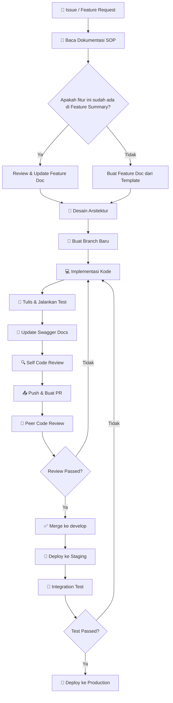

---

## 📝 Langkah Detail

### 1. Persiapan (Pre-Development)

| # | Langkah | Checklist |
|---|---------|-----------|
| 1.1 | Baca SOP yang relevan | ☐ Code Standards, API Design, Testing |
| 1.2 | Review Feature Summary | ☐ Pastikan fitur belum ada / perlu diupdate |
| 1.3 | Buat/Update Feature Document | ☐ Gunakan template di `docs/features/feature-template.md` |
| 1.4 | Identifikasi dependencies | ☐ Layer mana yang terpengaruh? |
| 1.5 | Estimasi waktu | ☐ Breakdown per sub-task |

### 2. Branching

```bash
# Buat branch dari develop
git checkout develop
git pull origin develop
git checkout -b feature/<nama-fitur>

# Contoh:
git checkout -b feature/user-authentication
git checkout -b feature/product-crud
git checkout -b fix/cart-calculation-error
git checkout -b hotfix/payment-crash
```

**Naming Convention Branch:**
- `feature/<nama>` — Fitur baru
- `fix/<nama>` — Bug fix
- `hotfix/<nama>` — Fix kritis di production
- `refactor/<nama>` — Refactoring kode
- `docs/<nama>` — Perubahan dokumentasi saja

### 3. Implementasi

1. **Mulai dari Domain Layer** — Definisikan entity dan interface
2. **Lanjut ke Use Case Layer** — Implementasi business logic
3. **Kemudian Repository Layer** — Implementasi akses data
4. **Terakhir Handler/Delivery Layer** — Implementasi HTTP handler
5. **Update Swagger annotations** — Dokumentasikan endpoint baru

### 4. Testing

```bash
# Unit test
go test ./internal/... -v -cover

# Test specific package
go test ./internal/usecase/... -v

# Test dengan coverage report
go test ./... -coverprofile=coverage.out
go tool cover -html=coverage.out
```

### 5. Pre-Push Checklist

- [ ] Semua test passed
- [ ] Tidak ada linter error (`golangci-lint run`)
- [ ] Swagger docs sudah di-generate ulang (`swag init`)
- [ ] Kode sudah di-format (`gofmt -w .`)
- [ ] Tidak ada credential/secret di kode
- [ ] Feature document sudah diupdate
- [ ] Commit message mengikuti conventional commits

### 6. Pull Request

**Template PR:**
```markdown
## Deskripsi
[Jelaskan perubahan yang dilakukan]

## Tipe Perubahan
- [ ] Fitur Baru
- [ ] Bug Fix
- [ ] Refactoring
- [ ] Dokumentasi

## Checklist
- [ ] Unit tests ditulis & passed
- [ ] Swagger docs diupdate
- [ ] Feature doc diupdate
- [ ] Tidak ada breaking changes
- [ ] Code review sendiri sudah dilakukan

## Screenshots (jika relevan)
[Tambahkan screenshot]
```

---

## ⏰ Review Cycle

| Fase | Durasi Maksimum |
|------|-----------------|
| Code Review | 24 jam setelah PR dibuat |
| Revision | 12 jam setelah review |
| Final Approval | 6 jam setelah revision |

---

*Terakhir diperbarui: 2026-05-03*
===== END FILE =====
````

---

## 📄 FILE 7 — `docs/SOP/02-code-standards.md`

````
===== FILE: docs/SOP/02-code-standards.md =====
# SOP 02 — Code Standards & Naming Convention

> **Tujuan**: Menjaga konsistensi kode, keterbacaan, dan kemudahan maintenance di seluruh codebase.

---

## 📋 Scope

SOP ini mencakup standar penulisan kode Go, naming convention, dan best practices yang **wajib** diikuti oleh semua kontributor.

---

## 🏗️ Prinsip Dasar

1. **Readability First** — Kode dibaca lebih sering daripada ditulis
2. **Idiomatic Go** — Ikuti konvensi dan idiom Go resmi
3. **Explicit over Implicit** — Lebih baik eksplisit daripada implisit
4. **Separation of Concerns** — Setiap package punya tanggung jawab tunggal
5. **Error Handling is NOT Optional** — Selalu handle error

---

## 📝 Naming Convention

### Package Names

```go
// ✅ BENAR — lowercase, singular, singkat
package user
package product
package order
package middleware

// ❌ SALAH
package Users        // tidak lowercase
package user_service // tidak gunakan underscore
package userPkg      // tidak gunakan singkatan aneh
```

### File Names

```
// ✅ BENAR — snake_case
user_handler.go
product_repository.go
order_usecase.go
jwt_middleware.go

// ❌ SALAH
userHandler.go       // camelCase
UserHandler.go       // PascalCase
user-handler.go      // kebab-case
```

### Variable & Function Names

```go
// ✅ Variable — camelCase
var userID string
var totalPrice float64
var isActive bool
var orderItems []OrderItem

// ✅ Exported (Public) — PascalCase
func GetUserByID(ctx context.Context, id string) (*User, error) {}
func NewProductUseCase(repo ProductRepository) *ProductUseCase {}

// ✅ Unexported (Private) — camelCase
func validateEmail(email string) error {}
func calculateDiscount(price float64, percentage int) float64 {}

// ❌ SALAH
func get_user() {}       // snake_case
func GETUSER() {}        // ALL CAPS
var user_name string     // snake_case variable
```

### Struct Names

```go
// ✅ Domain Entity
type User struct {
    ID        string    `bson:"_id,omitempty" json:"id"`
    Email     string    `bson:"email" json:"email"`
    Name      string    `bson:"name" json:"name"`
    Password  string    `bson:"password" json:"-"`
    Role      UserRole  `bson:"role" json:"role"`
    IsActive  bool      `bson:"is_active" json:"is_active"`
    CreatedAt time.Time `bson:"created_at" json:"created_at"`
    UpdatedAt time.Time `bson:"updated_at" json:"updated_at"`
}

// ✅ Request DTO
type CreateUserRequest struct {
    Email    string `json:"email" validate:"required,email"`
    Name     string `json:"name" validate:"required,min=2,max=100"`
    Password string `json:"password" validate:"required,min=8"`
}

// ✅ Response DTO
type UserResponse struct {
    ID       string    `json:"id"`
    Email    string    `json:"email"`
    Name     string    `json:"name"`
    Role     string    `json:"role"`
    JoinedAt time.Time `json:"joined_at"`
}
```

### Interface Names

```go
// ✅ BENAR — Gunakan suffix sesuai layer
type UserRepository interface {
    FindByID(ctx context.Context, id string) (*User, error)
    FindByEmail(ctx context.Context, email string) (*User, error)
    Create(ctx context.Context, user *User) error
    Update(ctx context.Context, user *User) error
    Delete(ctx context.Context, id string) error
}

type UserUseCase interface {
    GetByID(ctx context.Context, id string) (*UserResponse, error)
    Register(ctx context.Context, req *CreateUserRequest) (*UserResponse, error)
    Login(ctx context.Context, req *LoginRequest) (*TokenResponse, error)
}

// ❌ SALAH
type IUserRepository interface {} // Prefix "I" bukan gaya Go
type UserRepo interface {}        // Singkatan tidak jelas
```

### Constant Names

```go
// ✅ Grouped constants dengan iota
type UserRole string

const (
    RoleAdmin    UserRole = "admin"
    RoleCustomer UserRole = "customer"
    RoleSeller   UserRole = "seller"
)

// ✅ Configuration constants
const (
    DefaultPageSize    = 20
    MaxPageSize        = 100
    TokenExpiration    = 24 * time.Hour
    RefreshExpiration  = 7 * 24 * time.Hour
)
```

---

## 🏛️ Struktur Kode Per Layer

### Domain Layer

```go
// internal/domain/user.go
package domain

// Entity — Pure data structure, NO business logic yang bergantung pada external
type User struct {
    ID       string
    Email    string
    Name     string
    Password string
    Role     UserRole
}

// Repository Interface — Kontrak untuk data access
type UserRepository interface {
    FindByID(ctx context.Context, id string) (*User, error)
    Create(ctx context.Context, user *User) error
}

// Domain-level validation
func (u *User) Validate() error {
    if u.Email == "" {
        return ErrInvalidEmail
    }
    return nil
}
```

### Use Case Layer

```go
// internal/usecase/user_usecase.go
package usecase

type userUseCase struct {
    userRepo   domain.UserRepository
    hasher     PasswordHasher
    tokenGen   TokenGenerator
}

// Constructor — SELALU gunakan pattern ini
func NewUserUseCase(
    userRepo domain.UserRepository,
    hasher PasswordHasher,
    tokenGen TokenGenerator,
) domain.UserUseCase {
    return &userUseCase{
        userRepo: userRepo,
        hasher:   hasher,
        tokenGen: tokenGen,
    }
}

func (uc *userUseCase) Register(ctx context.Context, req *domain.CreateUserRequest) (*domain.UserResponse, error) {
    // 1. Validate input
    // 2. Check if user exists
    // 3. Hash password
    // 4. Create user
    // 5. Return response
}
```

### Repository Layer

```go
// internal/repository/mongo/user_repository.go
package mongo

type userRepository struct {
    collection *mongo.Collection
}

func NewUserRepository(db *mongo.Database) domain.UserRepository {
    return &userRepository{
        collection: db.Collection("users"),
    }
}

func (r *userRepository) FindByID(ctx context.Context, id string) (*domain.User, error) {
    // MongoDB query implementation
}
```

### Handler Layer

```go
// internal/delivery/http/handler/user_handler.go
package handler

type UserHandler struct {
    userUC domain.UserUseCase
}

func NewUserHandler(userUC domain.UserUseCase) *UserHandler {
    return &UserHandler{userUC: userUC}
}

// @Summary      Register new user
// @Description  Create a new user account
// @Tags         auth
// @Accept       json
// @Produce      json
// @Param        request body domain.CreateUserRequest true "User registration data"
// @Success      201 {object} domain.UserResponse
// @Failure      400 {object} domain.ErrorResponse
// @Router       /auth/register [post]
func (h *UserHandler) Register(w http.ResponseWriter, r *http.Request) {
    // 1. Decode request
    // 2. Call use case
    // 3. Write response
}
```

---

## 📏 Code Style Rules

### 1. Error Handling

```go
// ✅ BENAR — Selalu check error
result, err := repo.FindByID(ctx, id)
if err != nil {
    return nil, fmt.Errorf("find user by id: %w", err)
}

// ✅ Custom error types
var (
    ErrUserNotFound   = errors.New("user not found")
    ErrEmailExists    = errors.New("email already exists")
    ErrInvalidInput   = errors.New("invalid input")
    ErrUnauthorized   = errors.New("unauthorized")
)

// ❌ SALAH — Jangan pernah ignore error
result, _ := repo.FindByID(ctx, id)
```

### 2. Context Propagation

```go
// ✅ SELALU propagate context
func (uc *userUseCase) GetByID(ctx context.Context, id string) (*UserResponse, error) {
    user, err := uc.userRepo.FindByID(ctx, id)
    // ...
}

// ❌ SALAH — Jangan buat context baru di tengah chain
func (uc *userUseCase) GetByID(id string) (*UserResponse, error) {
    ctx := context.Background() // JANGAN!
}
```

### 3. Struct Initialization

```go
// ✅ Named fields
user := &domain.User{
    Email: req.Email,
    Name:  req.Name,
    Role:  domain.RoleCustomer,
}

// ❌ SALAH — Positional fields
user := &domain.User{req.Email, req.Name, domain.RoleCustomer}
```

### 4. Import Grouping

```go
import (
    // Standard library
    "context"
    "fmt"
    "net/http"
    "time"

    // Third-party packages
    "go.mongodb.org/mongo-driver/bson"
    "go.mongodb.org/mongo-driver/mongo"

    // Internal packages
    "github.com/yourorg/ecommerce/internal/domain"
    "github.com/yourorg/ecommerce/internal/usecase"
)
```

---

## 🔧 Tooling Wajib

| Tool | Fungsi | Command |
|------|--------|---------|
| `gofmt` | Format kode | `gofmt -w .` |
| `goimports` | Manage imports | `goimports -w .` |
| `golangci-lint` | Linting komprehensif | `golangci-lint run` |
| `go vet` | Static analysis | `go vet ./...` |
| `swag` | Generate Swagger docs | `swag init` |

### golangci-lint Configuration

```yaml
# .golangci.yml
run:
  timeout: 5m

linters:
  enable:
    - errcheck
    - gosimple
    - govet
    - ineffassign
    - staticcheck
    - unused
    - gofmt
    - goimports
    - misspell
    - unconvert
    - goconst
    - bodyclose
    - noctx

linters-settings:
  errcheck:
    check-type-assertions: true
  goconst:
    min-len: 3
    min-occurrences: 3
```

---

## 📐 Komentar & Dokumentasi

```go
// ✅ Package documentation
// Package usecase implements the application business logic layer.
// It contains use cases that orchestrate domain entities and
// repository interfaces to fulfill business requirements.
package usecase

// ✅ Exported function documentation
// NewUserUseCase creates a new instance of UserUseCase with the given dependencies.
// It requires a valid UserRepository, PasswordHasher, and TokenGenerator.
func NewUserUseCase(...) domain.UserUseCase {}

// ✅ Complex logic documentation
// calculateFinalPrice applies discount rules in the following order:
// 1. Voucher discount (percentage or fixed)
// 2. Membership tier discount
// 3. Minimum purchase threshold check
func calculateFinalPrice(items []CartItem, voucher *Voucher) float64 {}
```

---

*Terakhir diperbarui: 2026-05-03*
===== END FILE =====
````

---

## 📄 FILE 8 — `docs/SOP/03-git-branching-strategy.md`

````
===== FILE: docs/SOP/03-git-branching-strategy.md =====
# SOP 03 — Git Branching Strategy

> **Tujuan**: Menjaga repository tetap terorganisir dengan strategi branching yang jelas dan predictable.

---

## 📋 Scope

SOP ini mengatur cara penggunaan Git, strategi branching, dan konvensi commit message.

---

## 🌳 Branch Model — Git Flow (Simplified)

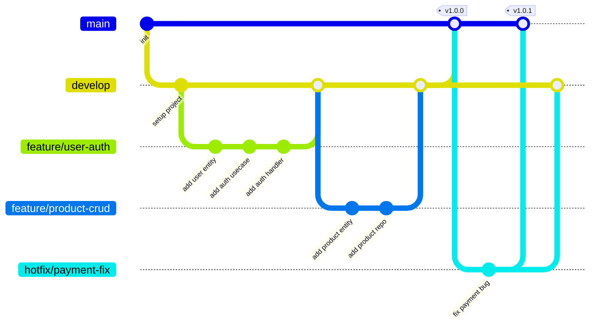

---

## 🔀 Branch Types

| Branch | Asal | Merge ke | Keterangan |
|--------|------|----------|------------|
| `main` | — | — | Production-ready code. **NEVER commit langsung.** |
| `develop` | `main` | `main` | Integration branch. Semua fitur merge ke sini dulu. |
| `feature/*` | `develop` | `develop` | Fitur baru. 1 branch per 1 fitur. |
| `fix/*` | `develop` | `develop` | Bug fix non-kritis |
| `hotfix/*` | `main` | `main` + `develop` | Fix kritis di production |
| `refactor/*` | `develop` | `develop` | Refactoring tanpa perubahan behavior |
| `docs/*` | `develop` | `develop` | Perubahan dokumentasi saja |
| `release/*` | `develop` | `main` + `develop` | Persiapan release (version bump, dll) |

---

## 📝 Commit Message Convention

Menggunakan **Conventional Commits** specification:

```
<type>(<scope>): <description>

[optional body]

[optional footer(s)]
```

### Types

| Type | Deskripsi | Contoh |
|------|-----------|--------|
| `feat` | Fitur baru | `feat(auth): add JWT token generation` |
| `fix` | Bug fix | `fix(cart): correct total price calculation` |
| `refactor` | Refactoring kode | `refactor(user): extract validation logic` |
| `docs` | Perubahan dokumentasi | `docs(api): update swagger annotations` |
| `test` | Menambah/memperbaiki test | `test(order): add unit test for checkout` |
| `chore` | Maintenance tasks | `chore(deps): update mongo driver to v2` |
| `style` | Formatting (tidak ubah logic) | `style: run gofmt on all files` |
| `perf` | Performance improvement | `perf(product): add index for search query` |
| `ci` | CI/CD changes | `ci: add golangci-lint to pipeline` |

### Scopes (E-Commerce)

| Scope | Layer/Area |
|-------|-----------|
| `auth` | Authentication & Authorization |
| `user` | User management |
| `product` | Product catalog |
| `cart` | Shopping cart |
| `order` | Order management |
| `payment` | Payment processing |
| `shipping` | Shipping & delivery |
| `review` | Product reviews |
| `admin` | Admin panel |
| `middleware` | Middleware (CORS, logging, dll) |
| `config` | Configuration |
| `deps` | Dependencies |
| `db` | Database |

### Contoh Commit Messages

```bash
# ✅ BENAR
feat(auth): implement user registration with email verification
fix(cart): prevent negative quantity in cart items
refactor(order): extract order status validation to domain layer
docs(api): add swagger annotations for product endpoints
test(user): add unit tests for password hashing
chore(db): add MongoDB indexes for performance
perf(product): implement cursor-based pagination

# ❌ SALAH
update code
fixed bug
WIP
asdf
changes
```

---

## 🔒 Branch Protection Rules

### `main` branch:
- ❌ No direct push
- ✅ Requires PR with at least 1 approval
- ✅ Requires all checks to pass
- ✅ Requires linear history (squash merge)

### `develop` branch:
- ❌ No direct push
- ✅ Requires PR
- ✅ Requires all checks to pass

---

## 📋 Merge Strategy

```bash
# Feature → develop: Squash merge (clean history)
git checkout develop
git merge --squash feature/user-auth

# develop → main: Merge commit (preservasi milestone)
git checkout main
git merge develop --no-ff

# hotfix → main: Merge commit
git checkout main
git merge hotfix/payment-fix --no-ff
```

---

*Terakhir diperbarui: 2026-05-03*
===== END FILE =====
````

---

## 📄 FILE 9 — `docs/SOP/04-code-review.md`

````
===== FILE: docs/SOP/04-code-review.md =====
# SOP 04 — Code Review

> **Tujuan**: Menjaga kualitas kode melalui proses review yang terstruktur dan konstruktif.

---

## 📋 Scope

SOP ini mengatur proses code review, kriteria evaluasi, dan ekspektasi bagi reviewer dan author.

---

## 🔍 Review Checklist

### 1. Arsitektur & Clean Architecture Compliance

- [ ] **Layer Dependencies** — Apakah dependency hanya mengarah ke dalam (Handler → UseCase → Repository → Domain)?
- [ ] **Interface Segregation** — Apakah interface didefinisikan di domain layer, bukan di implementation layer?
- [ ] **Dependency Injection** — Apakah dependencies di-inject melalui constructor, bukan hardcoded?
- [ ] **No Business Logic in Handler** — Handler hanya decode request, panggil use case, encode response?
- [ ] **No Database Code in UseCase** — UseCase hanya berinteraksi dengan Repository interface?

### 2. Code Quality

- [ ] **Naming Convention** — Sesuai dengan SOP 02?
- [ ] **Error Handling** — Semua error di-handle, tidak ada `_` untuk error?
- [ ] **Context Propagation** — `context.Context` selalu dipropagasikan?
- [ ] **No Magic Numbers** — Semua angka "ajaib" sudah dijadikan constant?
- [ ] **DRY Principle** — Tidak ada duplikasi kode yang bisa di-extract?
- [ ] **Single Responsibility** — Setiap function/method punya satu tanggung jawab?

### 3. Security

- [ ] **Input Validation** — Semua input dari user divalidasi?
- [ ] **SQL/NoSQL Injection** — Query parameter di-sanitize/parameterized?
- [ ] **Authentication** — Endpoint yang butuh auth sudah dilindungi middleware?
- [ ] **Authorization** — Role-based access control sudah benar?
- [ ] **Sensitive Data** — Password tidak di-log, token tidak di-return di response yang salah?
- [ ] **CORS** — Konfigurasi CORS sudah benar?

### 4. Testing

- [ ] **Unit Tests** — Ada unit test untuk business logic baru?
- [ ] **Test Coverage** — Coverage >= 70% untuk use case layer?
- [ ] **Edge Cases** — Test mencakup edge case (nil, empty, invalid input)?
- [ ] **Mock Usage** — Repository di-mock untuk unit test, bukan pakai DB langsung?

### 5. Documentation

- [ ] **Swagger Annotations** — Handler baru punya Swagger annotations?
- [ ] **Code Comments** — Logic kompleks diberi komentar "why", bukan "what"?
- [ ] **Feature Doc** — Feature document sudah diupdate?

### 6. Performance

- [ ] **Database Queries** — Tidak ada N+1 query problem?
- [ ] **Pagination** — List endpoint menggunakan pagination?
- [ ] **Indexing** — Query field yang sering diakses sudah di-index?
- [ ] **Context Timeout** — Operasi database punya timeout?

---

## 👥 Roles & Responsibilities

### Author (Pembuat PR)

1. Self-review sebelum membuat PR
2. Tulis deskripsi PR yang jelas (gunakan template)
3. Tag reviewer yang relevan
4. Respond terhadap feedback dalam 12 jam
5. Jangan defensive — terima feedback sebagai learning

### Reviewer

1. Review dalam 24 jam setelah di-tag
2. Berikan feedback yang **konstruktif dan spesifik**
3. Bedakan antara **blocking** (harus diperbaiki) dan **nit** (saran perbaikan)
4. Approve jika semua blocking issues sudah resolved
5. Jangan nitpick hal yang bisa di-handle oleh linter

### Review Comment Format

```markdown
// 🔴 BLOCKING: [Penjelasan masalah dan saran perbaikan]
// Ini harus diperbaiki sebelum merge

// 🟡 SUGGESTION: [Saran perbaikan]
// Ini bisa diperbaiki sekarang atau di PR lain

// 🟢 NIT: [Minor improvement]
// Opsional, tidak blocking

// ❓ QUESTION: [Pertanyaan untuk klarifikasi]
// Butuh penjelasan sebelum approve
```

---

## 📊 Review Flow

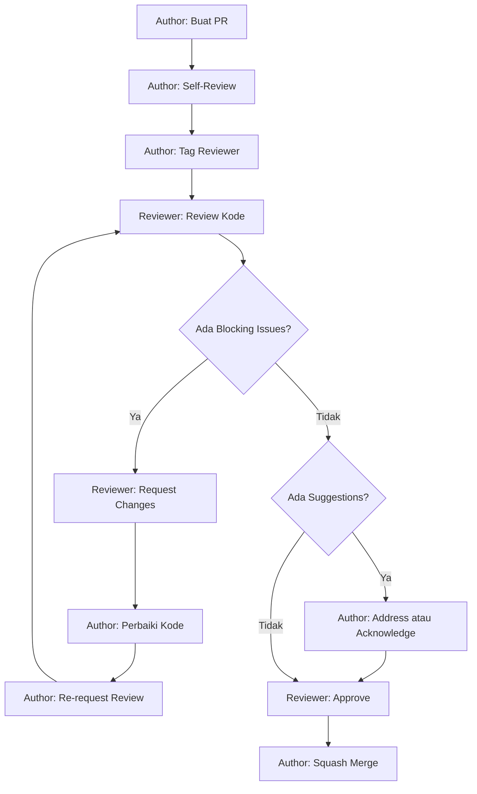

---

## 📏 Quality Gates

| Metrik | Minimum | Target |
|--------|---------|--------|
| Unit Test Coverage (UseCase) | 70% | 85% |
| Unit Test Coverage (Repository) | 50% | 70% |
| Linter Errors | 0 | 0 |
| Swagger Docs Coverage | 100% endpoints | 100% |
| Max Function Length | 50 lines | 30 lines |
| Max File Length | 500 lines | 300 lines |
| Cyclomatic Complexity | <= 15 | <= 10 |

---

*Terakhir diperbarui: 2026-05-03*
===== END FILE =====
````

---

## 📄 FILE 10 — `docs/SOP/05-testing-strategy.md`

````
===== FILE: docs/SOP/05-testing-strategy.md =====
# SOP 05 — Testing Strategy

> **Tujuan**: Menjamin kualitas dan reliabilitas kode melalui testing yang terstruktur.

---

## 🏗️ Testing Pyramid

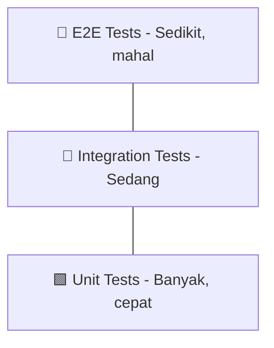

---

## 📝 Testing Per Layer

### 1. Domain Layer — Unit Test (Pure logic)

- Test entity validation, domain rules
- No mocks needed, pure functions
- Coverage target: **95%**

### 2. Use Case Layer — Unit Test + Mock

- Mock repository interfaces
- Test business logic orchestration
- Table-driven tests recommended
- Coverage target: **85%**

### 3. Repository Layer — Integration Test

- Use test database / testcontainers
- Tag dengan `//go:build integration`
- Coverage target: **70%**

### 4. Handler Layer — HTTP Test

- Gunakan `httptest` package
- Mock use case interfaces
- Test request/response serialization
- Coverage target: **80%**

---

## 📊 Coverage Requirements

| Layer | Minimum | Target |
|-------|---------|--------|
| Domain | 80% | 95% |
| UseCase | 70% | 85% |
| Repository | 50% | 70% |
| Handler | 60% | 80% |
| **Overall** | **65%** | **80%** |

---

## 🛠️ Test Commands

```bash
# Run semua unit tests
go test ./internal/... -v -count=1

# Run dengan coverage
go test ./internal/... -coverprofile=coverage.out
go tool cover -html=coverage.out -o coverage.html

# Run specific test
go test ./internal/usecase/... -run TestUserUseCase_Register -v

# Run integration tests
go test ./internal/repository/... -tags=integration -v

# Run test dengan race detector
go test ./internal/... -race -v
```

---

## 📏 Test Naming Convention

```
Pattern: Test<Struct>_<Method>/<scenario>

TestUserUseCase_Register/successful_registration
TestUserUseCase_Register/duplicate_email_error
TestUserRepository_FindByID/user_found
TestUserRepository_FindByID/user_not_found
```

---

## 🚫 Anti-Patterns

| Anti-Pattern | Solusi |
|--------------|-------|
| Test bergantung pada urutan | Setiap test harus independen |
| Akses DB langsung di unit test | Gunakan mock/interface |
| Test tanpa assertion | Selalu assert expected vs actual |
| Hardcoded test data | Gunakan test fixtures/builders |
| Terlalu banyak mock | Focus mock pada boundary layer |

---

*Terakhir diperbarui: 2026-05-03*
===== END FILE =====
````

---

## 📄 FILE 11 — `docs/SOP/06-api-design.md`

````
===== FILE: docs/SOP/06-api-design.md =====
# SOP 06 — API Design & Endpoint Standards

> **Tujuan**: Menjaga konsistensi desain API RESTful dan dokumentasi Swagger.

---

## 📋 Prinsip Desain API

1. **RESTful Convention** — Gunakan HTTP methods sesuai semantik
2. **Versioning** — Selalu prefix `/api/v1/`
3. **Consistent Response** — Format response seragam
4. **Pagination** — Semua list endpoint wajib paginated
5. **Filtering & Sorting** — Gunakan query params
6. **Documentation** — Setiap endpoint WAJIB punya Swagger annotation

---

## 🔗 URL Convention

```
# Resource URLs — gunakan plural nouns
GET    /api/v1/products          # List products
POST   /api/v1/products          # Create product
GET    /api/v1/products/:id      # Get product by ID
PUT    /api/v1/products/:id      # Update product
DELETE /api/v1/products/:id      # Delete product

# Nested resources
GET    /api/v1/products/:id/reviews      # List reviews for product
POST   /api/v1/products/:id/reviews      # Create review for product

# Actions (non-CRUD)
POST   /api/v1/auth/login                # Login
POST   /api/v1/auth/register             # Register
POST   /api/v1/auth/refresh              # Refresh token
POST   /api/v1/cart/checkout             # Checkout cart

# ❌ SALAH
GET    /api/v1/getProducts        # Verb di URL
POST   /api/v1/product            # Singular
GET    /api/v1/product-list       # Redundant
```

---

## 📦 Standard Response Format

### Success Response

```json
{
    "success": true,
    "message": "Product retrieved successfully",
    "data": {
        "id": "abc123",
        "name": "Product Name",
        "price": 150000
    }
}
```

### Success List Response (Paginated)

```json
{
    "success": true,
    "message": "Products retrieved successfully",
    "data": [
        {"id": "abc123", "name": "Product 1"},
        {"id": "def456", "name": "Product 2"}
    ],
    "meta": {
        "page": 1,
        "per_page": 20,
        "total": 150,
        "total_pages": 8
    }
}
```

### Error Response

```json
{
    "success": false,
    "message": "Validation failed",
    "error": {
        "code": "VALIDATION_ERROR",
        "details": [
            {"field": "email", "message": "email is required"},
            {"field": "password", "message": "password must be at least 8 characters"}
        ]
    }
}
```

---

## 📊 HTTP Status Codes

| Code | Kapan Digunakan |
|------|-----------------|
| `200 OK` | GET berhasil, UPDATE berhasil |
| `201 Created` | POST create berhasil |
| `204 No Content` | DELETE berhasil |
| `400 Bad Request` | Validation error, malformed request |
| `401 Unauthorized` | Token invalid / tidak ada |
| `403 Forbidden` | Tidak punya akses (role) |
| `404 Not Found` | Resource tidak ditemukan |
| `409 Conflict` | Duplikat data (email sudah ada, dll) |
| `422 Unprocessable Entity` | Business logic error |
| `429 Too Many Requests` | Rate limit exceeded |
| `500 Internal Server Error` | Server error (JANGAN expose detail) |

---

## 📖 Swagger Annotation Standard

```go
// @Summary      Create new product
// @Description  Create a new product in the catalog. Requires seller or admin role.
// @Tags         products
// @Accept       json
// @Produce      json
// @Security     BearerAuth
// @Param        request body domain.CreateProductRequest true "Product data"
// @Success      201 {object} domain.SuccessResponse{data=domain.ProductResponse}
// @Failure      400 {object} domain.ErrorResponse
// @Failure      401 {object} domain.ErrorResponse
// @Failure      403 {object} domain.ErrorResponse
// @Router       /products [post]
func (h *ProductHandler) Create(w http.ResponseWriter, r *http.Request) {}
```

### Swagger Setup

```bash
# Install swag CLI
go install github.com/swaggo/swag/cmd/swag@latest

# Generate docs
swag init -g cmd/api/main.go -o docs/swagger

# Format annotations
swag fmt
```

---

## 🔐 Authentication & Authorization

```
# Public endpoints — Tidak perlu token
POST   /api/v1/auth/register
POST   /api/v1/auth/login
GET    /api/v1/products          # Browse products

# Authenticated endpoints — Butuh Bearer token
GET    /api/v1/users/me          # [customer, seller, admin]
PUT    /api/v1/users/me          # [customer, seller, admin]
POST   /api/v1/cart/items        # [customer]
POST   /api/v1/orders            # [customer]

# Admin-only endpoints
GET    /api/v1/admin/users       # [admin]
DELETE /api/v1/admin/users/:id   # [admin]
```

---

## 📐 Query Parameters Standard

```
# Pagination
?page=1&per_page=20

# Sorting
?sort_by=created_at&sort_order=desc

# Filtering
?category=electronics&min_price=100000&max_price=500000

# Search
?q=keyword

# Combined
GET /api/v1/products?q=laptop&category=electronics&min_price=5000000&sort_by=price&sort_order=asc&page=1&per_page=20
```

---

*Terakhir diperbarui: 2026-05-03*
===== END FILE =====
````

---

## 📄 FILE 12 — `docs/SOP/07-deployment.md`

````
===== FILE: docs/SOP/07-deployment.md =====
# SOP 07 — Deployment & CI/CD

> **Tujuan**: Menjamin proses deployment yang aman, repeatable, dan traceable.

---

## 🔄 CI/CD Pipeline

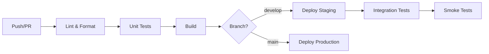

---

## 📋 Pipeline Stages

### 1. Lint & Format
```bash
gofmt -l .
golangci-lint run
swag fmt --dir ./internal/delivery/http/handler
```

### 2. Test
```bash
go test ./internal/... -v -race -coverprofile=coverage.out
```

### 3. Build
```bash
CGO_ENABLED=0 GOOS=linux go build -o ./bin/api ./cmd/api
```

### 4. Deploy
```bash
# Staging
go build -o ./bin/api ./cmd/api

# Production
CGO_ENABLED=0 GOOS=linux go build -o ./bin/api ./cmd/api
```

---

## 🔐 Environment Variables

| Variable | Deskripsi | Required |
|----------|-----------|----------|
| `APP_ENV` | `development`, `staging`, `production` | ✅ |
| `APP_PORT` | Port server (default: 8080) | ❌ |
| `MONGODB_URI` | MongoDB Atlas connection string | ✅ |
| `MONGODB_DATABASE` | Nama database | ✅ |
| `JWT_SECRET` | Secret key untuk JWT | ✅ |
| `JWT_EXPIRATION` | Token expiration (default: 24h) | ❌ |
| `LOG_LEVEL` | `debug`, `info`, `warn`, `error` | ❌ |
| `CORS_ORIGINS` | Allowed CORS origins | ❌ |

> ⚠️ **JANGAN PERNAH** commit `.env` file ke repository. Gunakan `.env.example` sebagai template.

---

## 🚀 Release Checklist

- [ ] Semua tests passed (unit + integration)
- [ ] Swagger docs up to date
- [ ] Migration scripts ready (jika ada perubahan schema)
- [ ] Environment variables documented
- [ ] Changelog updated
- [ ] Version tag created
- [ ] Rollback plan documented

---

*Terakhir diperbarui: 2026-05-03*
===== END FILE =====
````

---

## 📄 FILE 13 — `docs/SOP/08-error-handling.md`

````
===== FILE: docs/SOP/08-error-handling.md =====
# SOP 08 — Error Handling & Logging

> **Tujuan**: Standarisasi penanganan error dan logging di seluruh application layers.

---

## 🏗️ Error Handling Architecture

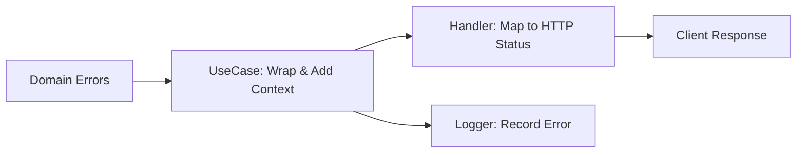

---

## 📝 Domain Errors

```go
// internal/domain/errors.go
package domain

var (
    // Entity errors
    ErrUserNotFound     = errors.New("user not found")
    ErrProductNotFound  = errors.New("product not found")
    ErrOrderNotFound    = errors.New("order not found")
    
    // Validation errors
    ErrInvalidEmail     = errors.New("invalid email format")
    ErrInvalidInput     = errors.New("invalid input")
    ErrWeakPassword     = errors.New("password too weak")
    
    // Business logic errors
    ErrEmailExists      = errors.New("email already exists")
    ErrInsufficientStock = errors.New("insufficient stock")
    ErrCartEmpty        = errors.New("cart is empty")
    ErrUnauthorized     = errors.New("unauthorized")
    ErrForbidden        = errors.New("forbidden")
)
```

---

## 🔄 Error Wrapping Pattern

```go
// UseCase layer — wrap dengan context
func (uc *userUseCase) GetByID(ctx context.Context, id string) (*UserResponse, error) {
    user, err := uc.userRepo.FindByID(ctx, id)
    if err != nil {
        return nil, fmt.Errorf("userUseCase.GetByID: %w", err)
    }
    return toUserResponse(user), nil
}
```

---

## 🗺️ Error to HTTP Status Mapping

```go
// Handler layer — map domain error ke HTTP status
func mapErrorToStatus(err error) int {
    switch {
    case errors.Is(err, domain.ErrUserNotFound),
         errors.Is(err, domain.ErrProductNotFound):
        return http.StatusNotFound           // 404
    case errors.Is(err, domain.ErrInvalidInput),
         errors.Is(err, domain.ErrInvalidEmail):
        return http.StatusBadRequest         // 400
    case errors.Is(err, domain.ErrEmailExists):
        return http.StatusConflict           // 409
    case errors.Is(err, domain.ErrUnauthorized):
        return http.StatusUnauthorized       // 401
    case errors.Is(err, domain.ErrForbidden):
        return http.StatusForbidden          // 403
    case errors.Is(err, domain.ErrInsufficientStock):
        return http.StatusUnprocessableEntity // 422
    default:
        return http.StatusInternalServerError // 500
    }
}
```

---

## 📊 Logging Standards

### Log Levels

| Level | Kapan Digunakan | Contoh |
|-------|-----------------|--------|
| `DEBUG` | Detail untuk debugging | Query params, decoded payload |
| `INFO` | Event normal | Request received, user created |
| `WARN` | Potensi masalah | Deprecated API called, retry |
| `ERROR` | Error yang perlu perhatian | DB connection failed, 500 error |

### Rules

1. **JANGAN log sensitive data** — password, token, credit card
2. **Gunakan structured logging** — JSON format, bukan plain text
3. **Sertakan request ID** — Untuk tracing across layers
4. **Log di handler layer** — Bukan di domain atau repository
5. **Production = INFO+** — Debug level hanya di development

### Structured Log Format

```json
{
    "level": "error",
    "timestamp": "2026-05-03T14:30:00Z",
    "request_id": "req-abc123",
    "method": "POST",
    "path": "/api/v1/orders",
    "user_id": "user-789",
    "error": "insufficient stock for product prod-456",
    "duration_ms": 45
}
```

---

*Terakhir diperbarui: 2026-05-03*
===== END FILE =====
````

---

## 📄 FILE 14 — `docs/architecture/clean-architecture.md`

````
===== FILE: docs/architecture/clean-architecture.md =====
# Clean Architecture — E-Commerce Backend

> **Prinsip Utama**: Dependency hanya mengarah ke dalam. Layer luar bergantung pada layer dalam, TIDAK PERNAH sebaliknya.

---

## 🎯 Arsitektur Overview

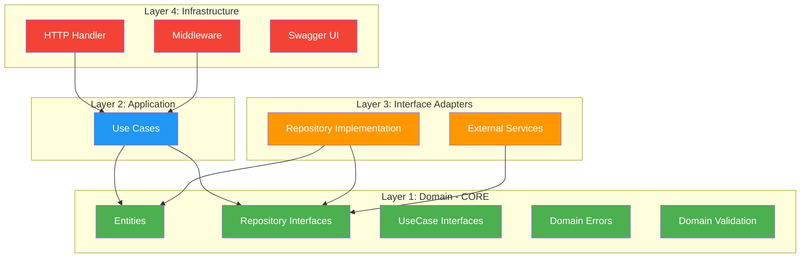

---

## 📐 Layer Rules

| Layer | Boleh Import | Tidak Boleh Import |
|-------|-------------|-------------------|
| **Domain** | Standard library saja | UseCase, Repository impl, Handler, third-party DB |
| **UseCase** | Domain | Repository impl, Handler, HTTP library |
| **Repository** | Domain, DB driver | UseCase, Handler |
| **Handler** | Domain, UseCase interface | Repository impl, DB driver |

---

## 🔄 Request Flow

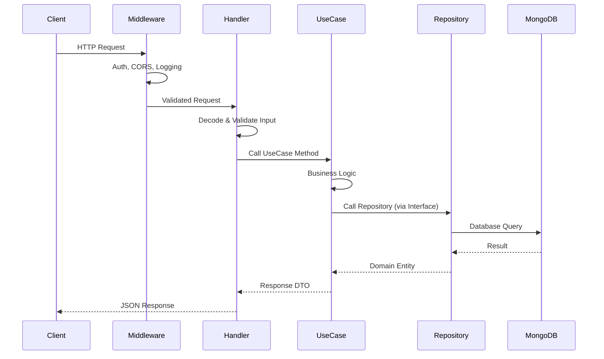

---

## 🏛️ Dependency Injection Flow

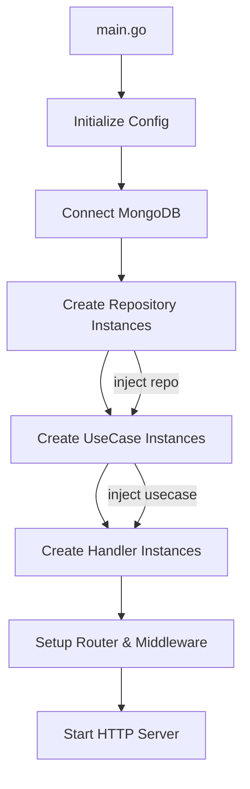

```go
// cmd/api/main.go — Dependency Injection
func main() {
    cfg := config.Load()
    db := mongodb.Connect(cfg.MongoURI)
    
    // Repository layer
    userRepo := mongoRepo.NewUserRepository(db)
    productRepo := mongoRepo.NewProductRepository(db)
    
    // UseCase layer — inject repository interfaces
    userUC := usecase.NewUserUseCase(userRepo, hasher, tokenGen)
    productUC := usecase.NewProductUseCase(productRepo)
    
    // Handler layer — inject usecase interfaces
    userHandler := handler.NewUserHandler(userUC)
    productHandler := handler.NewProductHandler(productUC)
    
    // Router
    router := http.NewServeMux()
    registerRoutes(router, userHandler, productHandler)
    
    http.ListenAndServe(":8080", router)
}
```

---

## 📏 Layer Violation Detector

Gunakan rules ini untuk mendeteksi pelanggaran arsitektur:

| Violation | Contoh | Perbaikan |
|-----------|--------|-----------|
| Handler import DB driver | `import "go.mongodb.org/..."` di handler | Gunakan UseCase interface |
| UseCase import HTTP | `import "net/http"` di usecase | Gunakan domain DTOs |
| Domain import third-party | `import "go.mongodb.org/..."` di domain | Hanya standard library |
| Repository berisi business logic | `if price > discount ...` di repo | Pindahkan ke UseCase |
| Handler berisi business logic | Validasi kompleks di handler | Pindahkan ke UseCase |

---

*Terakhir diperbarui: 2026-05-03*
===== END FILE =====
````

---

## 📄 FILE 15 — `docs/architecture/project-structure.md`

````
===== FILE: docs/architecture/project-structure.md =====
# Project Structure — E-Commerce Backend

> **Penjelasan detail setiap folder dan file dalam proyek.**

---

## 📁 Struktur Folder Lengkap

```
ecommerce-backend/
│
├── cmd/                              # Application entry points
│   └── api/
│       └── main.go                   # HTTP Server bootstrap & DI
│
├── internal/                         # Private application code
│   │
│   ├── config/                       # Configuration management
│   │   └── config.go                 # Load env vars & config struct
│   │
│   ├── domain/                       # 🟢 LAYER 1: Core Business Logic
│   │   ├── user.go                   # User entity + UserRepository interface
│   │   ├── product.go                # Product entity + ProductRepository interface
│   │   ├── category.go               # Category entity + interface
│   │   ├── cart.go                    # Cart entity + interface
│   │   ├── order.go                  # Order entity + interface
│   │   ├── payment.go                # Payment entity + interface
│   │   ├── review.go                 # Review entity + interface
│   │   ├── errors.go                 # Domain error definitions
│   │   ├── dto.go                    # Request/Response DTOs
│   │   └── constants.go             # Domain constants & enums
│   │
│   ├── usecase/                      # 🔵 LAYER 2: Application Logic
│   │   ├── user_usecase.go           # User business logic
│   │   ├── auth_usecase.go           # Authentication logic
│   │   ├── product_usecase.go        # Product business logic
│   │   ├── cart_usecase.go           # Cart business logic
│   │   ├── order_usecase.go          # Order business logic
│   │   ├── payment_usecase.go        # Payment business logic
│   │   └── review_usecase.go         # Review business logic
│   │
│   ├── repository/                   # 🟠 LAYER 3: Data Access
│   │   └── mongo/
│   │       ├── user_repository.go    # MongoDB User implementation
│   │       ├── product_repository.go # MongoDB Product implementation
│   │       ├── cart_repository.go    # MongoDB Cart implementation
│   │       ├── order_repository.go   # MongoDB Order implementation
│   │       └── helpers.go            # Shared MongoDB helpers
│   │
│   ├── delivery/                     # 🔴 LAYER 4: Interface Adapters
│   │   └── http/
│   │       ├── handler/
│   │       │   ├── user_handler.go   # User HTTP handlers
│   │       │   ├── auth_handler.go   # Auth HTTP handlers
│   │       │   ├── product_handler.go# Product HTTP handlers
│   │       │   ├── cart_handler.go   # Cart HTTP handlers
│   │       │   ├── order_handler.go  # Order HTTP handlers
│   │       │   └── response.go       # Response helper functions
│   │       ├── middleware/
│   │       │   ├── auth.go           # JWT authentication middleware
│   │       │   ├── cors.go           # CORS middleware
│   │       │   ├── logging.go        # Request logging middleware
│   │       │   ├── recovery.go       # Panic recovery middleware
│   │       │   └── ratelimit.go      # Rate limiting middleware
│   │       └── router/
│   │           └── router.go         # Route definitions
│   │
│   └── pkg/                          # Internal shared packages
│       ├── hash/
│       │   └── bcrypt.go             # Password hashing
│       ├── token/
│       │   └── jwt.go                # JWT token generation
│       ├── validator/
│       │   └── validator.go          # Input validation
│       └── mongodb/
│           └── connection.go         # MongoDB connection helper
│
├── docs/                             # 📚 Documentation
│   ├── README.md                     # Documentation hub
│   ├── SOP/                          # Standard Operating Procedures
│   ├── architecture/                 # Architecture documentation
│   ├── features/                     # Feature documentation
│   ├── api/                          # API documentation
│   ├── todo/                         # To-do lists
│   └── swagger/                      # Generated Swagger files
│       ├── docs.go
│       ├── swagger.json
│       └── swagger.yaml
│
├── .env.example                      # Environment template
├── .gitignore                        # Git ignore rules
├── .golangci.yml                     # Linter configuration
├── go.mod                            # Go module definition
├── go.sum                            # Go module checksums
├── Makefile                          # Build & dev commands
└── README.md                         # Project README
```

---

## 📏 Folder Rules

| Folder | Aturan |
|--------|--------|
| `cmd/` | Hanya bootstrap code. Tidak ada business logic. |
| `internal/domain/` | ZERO dependency ke package lain. Hanya standard library. |
| `internal/usecase/` | Import domain saja. Tidak import repository impl atau HTTP. |
| `internal/repository/` | Import domain saja. Implementasi interface dari domain. |
| `internal/delivery/` | Import domain dan usecase interface. Tidak import repository. |
| `internal/pkg/` | Utility yang dipakai internal. Tidak import business layers. |
| `docs/` | Dokumentasi saja. Tidak ada kode. |

---

## 🔧 Makefile Commands

```makefile
.PHONY: run build test lint swagger

# Development
run:
	go run cmd/api/main.go

# Build
build:
	CGO_ENABLED=0 go build -o bin/api cmd/api/main.go

# Testing
test:
	go test ./internal/... -v -race -count=1

test-cover:
	go test ./internal/... -coverprofile=coverage.out
	go tool cover -html=coverage.out -o coverage.html

# Linting
lint:
	golangci-lint run ./...

# Swagger
swagger:
	swag init -g cmd/api/main.go -o docs/swagger

# Format
fmt:
	gofmt -w .
	goimports -w .

# All checks before push
check: fmt lint test swagger
	@echo "All checks passed! ✅"
```

---

*Terakhir diperbarui: 2026-05-03*
===== END FILE =====
````

---

## 📄 FILE 16 — `docs/architecture/dependency-graph.md`

````
===== FILE: docs/architecture/dependency-graph.md =====
# Dependency Graph & AI Context

> **Tujuan**: Memberikan konteks arsitektur kepada AI assistant dan developer melalui dependency graph.

---

## 🔗 Dependency Graph

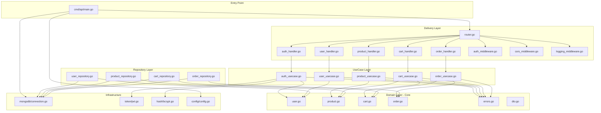

---

## 🤖 AI Context Guide

### Ketika AI merencanakan fitur baru, AI HARUS:

1. **Baca SOP terlebih dahulu** — `docs/SOP/` 
2. **Check Feature Summary** — `docs/features/feature-summary.md`
3. **Pahami Dependency Graph** — Diagram di atas
4. **Ikuti Clean Architecture** — `docs/architecture/clean-architecture.md`
5. **Gunakan Naming Convention** — `docs/SOP/02-code-standards.md`

### Context Map per Domain

| Domain | Depends On | Depended By |
|--------|-----------|-------------|
| **User** | - | Auth, Order, Review |
| **Product** | Category | Cart, Order, Review |
| **Category** | - | Product |
| **Cart** | Product, User | Order |
| **Order** | Cart, Product, User, Payment | - |
| **Payment** | Order | - |
| **Review** | Product, User, Order | Product (rating) |

### Urutan Implementasi Fitur (Recommended)

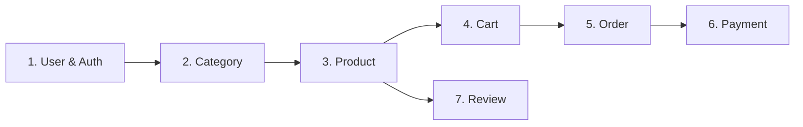

---

## 🔧 Tools untuk Generate Graph

```bash
# Install godepgraph
go install github.com/kisielk/godepgraph@latest

# Generate dependency graph
godepgraph -s ./cmd/api | dot -Tpng -o docs/dep-graph.png

# Install go-callvis untuk call graph
go install github.com/ofabry/go-callvis@latest
go-callvis -group pkg ./cmd/api
```

---

*Terakhir diperbarui: 2026-05-03*
===== END FILE =====
````

---

## 📄 FILE 17 — `docs/features/feature-template.md`

````
===== FILE: docs/features/feature-template.md =====
# 📄 Feature Document Template

> **Gunakan template ini untuk mendokumentasikan setiap fitur baru sebelum implementasi.**

---

## 🏷️ Feature: [Nama Fitur]

**Author**: [Nama]  
**Created**: [YYYY-MM-DD]  
**Status**: 📋 Planned | 🔨 In Progress | ✅ Done  
**Priority**: 🔴 High | 🟡 Medium | 🟢 Low  

---

## 📋 Deskripsi

[Jelaskan fitur ini secara singkat — apa yang dilakukan dan mengapa dibutuhkan]

---

## 🎯 User Stories

1. Sebagai [role], saya ingin [aksi], agar [manfaat]
2. ...

---

## 📐 Technical Design

### Domain Entity

```go
type [EntityName] struct {
    // fields
}
```

### Repository Interface

```go
type [Entity]Repository interface {
    // methods
}
```

### Use Case Interface

```go
type [Entity]UseCase interface {
    // methods
}
```

---

## 🔗 Endpoints

| Method | Endpoint | Deskripsi | Auth |
|--------|----------|-----------|------|
| GET | `/api/v1/...` | ... | ☐/☑ |
| POST | `/api/v1/...` | ... | ☐/☑ |

---

## 📊 Request/Response Examples

### Request

```json
{
    "field": "value"
}
```

### Response

```json
{
    "success": true,
    "data": {}
}
```

---

## ⚙️ Business Rules

1. [Rule 1]
2. [Rule 2]

---

## 🧪 Test Scenarios

| # | Scenario | Input | Expected Output |
|---|----------|-------|-----------------|
| 1 | Happy path | ... | ... |
| 2 | Validation error | ... | ... |
| 3 | Not found | ... | ... |

---

## 📁 Files to Create/Modify

- [ ] `internal/domain/[entity].go`
- [ ] `internal/usecase/[entity]_usecase.go`
- [ ] `internal/repository/mongo/[entity]_repository.go`
- [ ] `internal/delivery/http/handler/[entity]_handler.go`
- [ ] Test files for each layer

---

## 🔗 Dependencies

- Depends on: [list features this depends on]
- Depended by: [list features that depend on this]

---

## 📝 Notes

[Catatan tambahan, edge cases, atau keputusan arsitektur yang perlu diingat]
===== END FILE =====
````

---

## 📄 FILE 18 — `docs/features/feature-summary.md`

````
===== FILE: docs/features/feature-summary.md =====
# 📋 Feature Summary — E-Commerce Backend

> **Ringkasan lengkap semua fitur yang direncanakan untuk platform E-Commerce.**

---

## 🗺️ Feature Map Overview

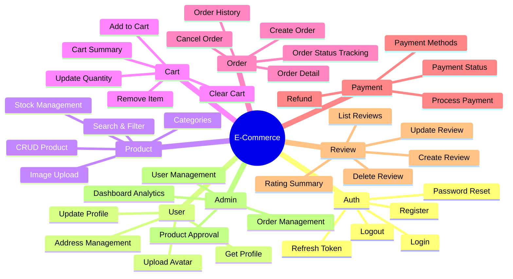

---

## 📊 Feature Details

### 🔐 1. Authentication & Authorization

| Fitur | Method | Endpoint | Status | Priority |
|-------|--------|----------|--------|----------|
| Register | POST | `/api/v1/auth/register` | 📋 Planned | 🔴 High |
| Login | POST | `/api/v1/auth/login` | 📋 Planned | 🔴 High |
| Refresh Token | POST | `/api/v1/auth/refresh` | 📋 Planned | 🔴 High |
| Logout | POST | `/api/v1/auth/logout` | 📋 Planned | 🟡 Medium |
| Forgot Password | POST | `/api/v1/auth/forgot-password` | 📋 Planned | 🟡 Medium |
| Reset Password | POST | `/api/v1/auth/reset-password` | 📋 Planned | 🟡 Medium |

**Business Rules:**
- Password minimum 8 karakter, harus ada uppercase, lowercase, angka
- JWT token expiration: 24 jam
- Refresh token expiration: 7 hari
- Rate limit login: 5 attempts per 15 menit

---

### 👤 2. User Management

| Fitur | Method | Endpoint | Status | Priority |
|-------|--------|----------|--------|----------|
| Get Profile | GET | `/api/v1/users/me` | 📋 Planned | 🔴 High |
| Update Profile | PUT | `/api/v1/users/me` | 📋 Planned | 🔴 High |
| Change Password | PUT | `/api/v1/users/me/password` | 📋 Planned | 🟡 Medium |
| Add Address | POST | `/api/v1/users/me/addresses` | 📋 Planned | 🟡 Medium |
| List Addresses | GET | `/api/v1/users/me/addresses` | 📋 Planned | 🟡 Medium |
| Delete Address | DELETE | `/api/v1/users/me/addresses/:id` | 📋 Planned | 🟡 Medium |

**Roles:**
- `customer` — Beli produk
- `seller` — Jual produk
- `admin` — Kelola platform

---

### 📦 3. Product Catalog

| Fitur | Method | Endpoint | Status | Priority |
|-------|--------|----------|--------|----------|
| List Products | GET | `/api/v1/products` | 📋 Planned | 🔴 High |
| Get Product | GET | `/api/v1/products/:id` | 📋 Planned | 🔴 High |
| Create Product | POST | `/api/v1/products` | 📋 Planned | 🔴 High |
| Update Product | PUT | `/api/v1/products/:id` | 📋 Planned | 🔴 High |
| Delete Product | DELETE | `/api/v1/products/:id` | 📋 Planned | 🟡 Medium |
| Search Products | GET | `/api/v1/products?q=keyword` | 📋 Planned | 🔴 High |
| List Categories | GET | `/api/v1/categories` | 📋 Planned | 🔴 High |
| Create Category | POST | `/api/v1/categories` | 📋 Planned | 🟡 Medium |

**Business Rules:**
- Hanya seller/admin yang bisa create/update/delete product
- Product harus punya minimal 1 gambar
- Stok tidak boleh negatif
- Pagination default: 20 items per page

---

### 🛒 4. Shopping Cart

| Fitur | Method | Endpoint | Status | Priority |
|-------|--------|----------|--------|----------|
| Get Cart | GET | `/api/v1/cart` | 📋 Planned | 🔴 High |
| Add to Cart | POST | `/api/v1/cart/items` | 📋 Planned | 🔴 High |
| Update Quantity | PUT | `/api/v1/cart/items/:id` | 📋 Planned | 🔴 High |
| Remove Item | DELETE | `/api/v1/cart/items/:id` | 📋 Planned | 🔴 High |
| Clear Cart | DELETE | `/api/v1/cart` | 📋 Planned | 🟡 Medium |

**Business Rules:**
- Quantity tidak boleh 0 atau negatif
- Check stok saat add to cart
- 1 user = 1 cart aktif
- Cart otomatis clear setelah checkout

---

### 📑 5. Order Management

| Fitur | Method | Endpoint | Status | Priority |
|-------|--------|----------|--------|----------|
| Create Order | POST | `/api/v1/orders` | 📋 Planned | 🔴 High |
| List Orders | GET | `/api/v1/orders` | 📋 Planned | 🔴 High |
| Get Order | GET | `/api/v1/orders/:id` | 📋 Planned | 🔴 High |
| Cancel Order | PUT | `/api/v1/orders/:id/cancel` | 📋 Planned | 🟡 Medium |
| Update Status | PUT | `/api/v1/orders/:id/status` | 📋 Planned | 🟡 Medium |

**Order Status Flow:**
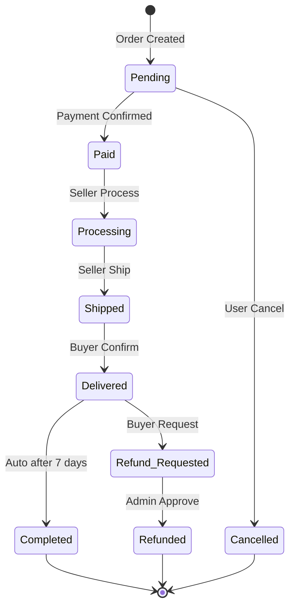

---

### 💳 6. Payment

| Fitur | Method | Endpoint | Status | Priority |
|-------|--------|----------|--------|----------|
| Get Payment Methods | GET | `/api/v1/payments/methods` | 📋 Planned | 🟡 Medium |
| Process Payment | POST | `/api/v1/payments` | 📋 Planned | 🔴 High |
| Payment Status | GET | `/api/v1/payments/:id` | 📋 Planned | 🔴 High |
| Payment Callback | POST | `/api/v1/payments/callback` | 📋 Planned | 🔴 High |

---

### ⭐ 7. Reviews & Ratings

| Fitur | Method | Endpoint | Status | Priority |
|-------|--------|----------|--------|----------|
| Create Review | POST | `/api/v1/products/:id/reviews` | 📋 Planned | 🟡 Medium |
| List Reviews | GET | `/api/v1/products/:id/reviews` | 📋 Planned | 🟡 Medium |
| Update Review | PUT | `/api/v1/reviews/:id` | 📋 Planned | 🟢 Low |
| Delete Review | DELETE | `/api/v1/reviews/:id` | 📋 Planned | 🟢 Low |

**Business Rules:**
- Hanya bisa review setelah order status = Completed
- 1 user = 1 review per product
- Rating: 1-5 stars

---

### 🛡️ 8. Admin Panel

| Fitur | Method | Endpoint | Status | Priority |
|-------|--------|----------|--------|----------|
| List Users | GET | `/api/v1/admin/users` | 📋 Planned | 🟡 Medium |
| Ban User | PUT | `/api/v1/admin/users/:id/ban` | 📋 Planned | 🟢 Low |
| List All Orders | GET | `/api/v1/admin/orders` | 📋 Planned | 🟡 Medium |
| Dashboard Stats | GET | `/api/v1/admin/dashboard` | 📋 Planned | 🟢 Low |

---

## 📈 Status Legend

| Icon | Status |
|------|--------|
| 📋 | Planned — Belum dikerjakan |
| 🔨 | In Progress — Sedang dikerjakan |
| ✅ | Done — Selesai & tested |
| 🔴 | High Priority |
| 🟡 | Medium Priority |
| 🟢 | Low Priority |

---

*Terakhir diperbarui: 2026-05-03*
===== END FILE =====
````

---

## 📄 FILE 19 — `docs/api/endpoints.md`

````
===== FILE: docs/api/endpoints.md =====
# 🔗 API Endpoints — E-Commerce Backend

> **Daftar lengkap semua REST API endpoints.**

---

## 📋 Base URL

```
Development : http://localhost:8080/api/v1
Staging     : https://staging-api.example.com/api/v1
Production  : https://api.example.com/api/v1
```

---

## 📊 Endpoint Summary

| # | Group | Endpoints | Auth Required |
|---|-------|-----------|---------------|
| 1 | Auth | 6 | Partial |
| 2 | Users | 6 | ✅ Yes |
| 3 | Products | 6 | Partial |
| 4 | Categories | 4 | Partial |
| 5 | Cart | 5 | ✅ Yes |
| 6 | Orders | 5 | ✅ Yes |
| 7 | Payments | 4 | ✅ Yes |
| 8 | Reviews | 4 | Partial |
| 9 | Admin | 4 | ✅ Admin Only |
| | **Total** | **44** | |

---

## 🔐 Authentication

```
Authorization: Bearer <jwt_token>
```

---

## 📝 Detailed Endpoints

### 🔐 Auth

```
POST   /auth/register          # Register user baru
POST   /auth/login             # Login & dapatkan token
POST   /auth/refresh           # Refresh expired token
POST   /auth/logout            # Invalidate token
POST   /auth/forgot-password   # Kirim email reset password
POST   /auth/reset-password    # Reset password dengan token
```

### 👤 Users

```
GET    /users/me                 # Get profil sendiri         [Auth]
PUT    /users/me                 # Update profil sendiri      [Auth]
PUT    /users/me/password        # Ganti password             [Auth]
POST   /users/me/addresses       # Tambah alamat              [Auth]
GET    /users/me/addresses       # List alamat                [Auth]
DELETE /users/me/addresses/:id   # Hapus alamat               [Auth]
```

### 📦 Products

```
GET    /products                 # List products (+ filter, sort, search)
GET    /products/:id             # Get product detail
POST   /products                 # Create product             [Seller/Admin]
PUT    /products/:id             # Update product             [Seller/Admin]
DELETE /products/:id             # Delete product             [Seller/Admin]
GET    /products/:id/reviews     # List reviews for product
```

### 📂 Categories

```
GET    /categories               # List semua categories
GET    /categories/:id           # Get category detail
POST   /categories               # Create category            [Admin]
PUT    /categories/:id           # Update category            [Admin]
```

### 🛒 Cart

```
GET    /cart                     # Get cart items              [Auth]
POST   /cart/items               # Add item to cart            [Auth]
PUT    /cart/items/:id           # Update item quantity        [Auth]
DELETE /cart/items/:id           # Remove item from cart       [Auth]
DELETE /cart                     # Clear entire cart           [Auth]
```

### 📑 Orders

```
POST   /orders                   # Create order (checkout)    [Auth]
GET    /orders                   # List my orders             [Auth]
GET    /orders/:id               # Get order detail           [Auth]
PUT    /orders/:id/cancel        # Cancel order               [Auth]
PUT    /orders/:id/status        # Update status              [Seller/Admin]
```

### 💳 Payments

```
GET    /payments/methods         # List payment methods       [Auth]
POST   /payments                 # Process payment            [Auth]
GET    /payments/:id             # Get payment status         [Auth]
POST   /payments/callback        # Payment gateway callback   [Webhook]
```

### ⭐ Reviews

```
POST   /products/:id/reviews     # Create review              [Auth, Buyer]
GET    /products/:id/reviews     # List product reviews
PUT    /reviews/:id              # Update my review           [Auth]
DELETE /reviews/:id              # Delete my review           [Auth]
```

### 🛡️ Admin

```
GET    /admin/users              # List all users             [Admin]
PUT    /admin/users/:id/ban      # Ban/unban user             [Admin]
GET    /admin/orders             # List all orders            [Admin]
GET    /admin/dashboard          # Dashboard statistics       [Admin]
```

---

## 📐 Common Query Parameters

| Parameter | Type | Default | Contoh |
|-----------|------|---------|--------|
| `page` | int | 1 | `?page=2` |
| `per_page` | int | 20 | `?per_page=50` |
| `sort_by` | string | `created_at` | `?sort_by=price` |
| `sort_order` | string | `desc` | `?sort_order=asc` |
| `q` | string | - | `?q=laptop` |

### Product-specific Filters

| Parameter | Type | Contoh |
|-----------|------|--------|
| `category` | string | `?category=electronics` |
| `min_price` | float | `?min_price=100000` |
| `max_price` | float | `?max_price=5000000` |
| `in_stock` | bool | `?in_stock=true` |
| `seller_id` | string | `?seller_id=abc123` |

---

## 📖 Swagger UI

Akses Swagger documentation di browser:

```
http://localhost:8080/swagger/index.html
```

---

*Terakhir diperbarui: 2026-05-03*
===== END FILE =====
````

---

## 📄 FILE 20 — `docs/api/swagger-guide.md`

````
===== FILE: docs/api/swagger-guide.md =====
# 📖 Swagger Setup Guide

> **Panduan setup dan penggunaan Swagger (Swaggo) untuk API documentation.**

---

## 🛠️ Setup

### 1. Install Swag CLI

```bash
go install github.com/swaggo/swag/cmd/swag@latest
```

Pastikan `$GOPATH/bin` ada di system PATH.

### 2. Install Dependencies

```bash
# HTTP handler wrapper (pilih salah satu sesuai router)
# Untuk net/http standar:
go get -u github.com/swaggo/http-swagger/v2

# Import generated docs
# (otomatis setelah swag init)
```

### 3. Tambahkan General API Info di main.go

```go
// @title           E-Commerce API
// @version         1.0
// @description     E-Commerce Backend API built with Go Clean Architecture
// @termsOfService  http://swagger.io/terms/

// @contact.name   API Support
// @contact.email  support@ecommerce.com

// @license.name  MIT
// @license.url   https://opensource.org/licenses/MIT

// @host      localhost:8080
// @BasePath  /api/v1

// @securityDefinitions.apikey BearerAuth
// @in header
// @name Authorization
// @description Enter "Bearer {token}" to authenticate

func main() {
    // ...
}
```

### 4. Generate Documentation

```bash
# Generate dari root project
swag init -g cmd/api/main.go -o docs/swagger

# Format annotations
swag fmt
```

### 5. Register Swagger Route

```go
import (
    httpSwagger "github.com/swaggo/http-swagger/v2"
    _ "your-module/docs/swagger"
)

// Di router setup:
mux.Handle("/swagger/", httpSwagger.WrapHandler)
```

---

## 📝 Annotation Cheat Sheet

### Endpoint Documentation

```go
// @Summary      Short description
// @Description  Detailed description
// @Tags         group-name
// @Accept       json
// @Produce      json
// @Security     BearerAuth
// @Param        id     path     string  true  "Resource ID"
// @Param        page   query    int     false "Page number" default(1)
// @Param        body   body     domain.CreateRequest  true  "Request body"
// @Success      200    {object} domain.SuccessResponse{data=domain.Entity}
// @Success      201    {object} domain.SuccessResponse{data=domain.Entity}
// @Failure      400    {object} domain.ErrorResponse
// @Failure      401    {object} domain.ErrorResponse
// @Failure      404    {object} domain.ErrorResponse
// @Failure      500    {object} domain.ErrorResponse
// @Router       /resource/{id} [get]
```

### Common Param Types

| Location | Keyword | Contoh |
|----------|---------|--------|
| URL Path | `path` | `@Param id path string true "ID"` |
| Query String | `query` | `@Param page query int false "Page"` |
| Request Body | `body` | `@Param req body CreateReq true "Body"` |
| Header | `header` | `@Param token header string true "Token"` |

---

## 🔧 Commands

```bash
# Generate docs
swag init -g cmd/api/main.go -o docs/swagger

# Format annotations
swag fmt

# Validate annotations
swag init --parseInternal --parseDependency
```

---

*Terakhir diperbarui: 2026-05-03*
===== END FILE =====
````

---

## 📄 FILE 21 — `docs/todo/master-todo.md`

````
===== FILE: docs/todo/master-todo.md =====
# 📋 Master To-Do List — E-Commerce Backend

> **Checklist pengembangan proyek E-Commerce Backend.**  
> Update status setiap kali ada progress.

---

## Phase 0: Project Setup ⚙️

- [ ] Initialize Go module (`go mod init`)
- [ ] Setup project folder structure (clean architecture)
- [ ] Setup MongoDB Atlas connection
- [ ] Create configuration management (env vars)
- [ ] Setup Makefile
- [ ] Setup `.gitignore` & `.env.example`
- [ ] Setup `golangci-lint` configuration
- [ ] Setup Swagger (Swaggo)
- [ ] Setup basic middleware (CORS, logging, recovery)
- [ ] Setup standard response helpers

---

## Phase 1: Authentication & User Management 🔐

- [ ] **Domain Layer**
  - [ ] User entity
  - [ ] UserRepository interface
  - [ ] AuthUseCase interface
  - [ ] Domain errors
  - [ ] Request/Response DTOs

- [ ] **Repository Layer**
  - [ ] MongoDB User repository implementation
  - [ ] Create indexes (email unique)

- [ ] **UseCase Layer**
  - [ ] Register use case
  - [ ] Login use case
  - [ ] Refresh token use case
  - [ ] Password hashing (bcrypt)
  - [ ] JWT token generation

- [ ] **Handler Layer**
  - [ ] Register handler + Swagger
  - [ ] Login handler + Swagger
  - [ ] Refresh handler + Swagger
  - [ ] Auth middleware (JWT validation)

- [ ] **Testing**
  - [ ] Domain validation tests
  - [ ] UseCase unit tests (mock repo)
  - [ ] Handler HTTP tests
  - [ ] Integration tests

---

## Phase 2: Product Catalog 📦

- [ ] **Domain Layer**
  - [ ] Product entity
  - [ ] Category entity
  - [ ] ProductRepository interface
  - [ ] CategoryRepository interface

- [ ] **Repository Layer**
  - [ ] MongoDB Product repository
  - [ ] MongoDB Category repository
  - [ ] Search & filter implementation
  - [ ] Pagination implementation

- [ ] **UseCase Layer**
  - [ ] Product CRUD use cases
  - [ ] Category CRUD use cases
  - [ ] Product search & filter

- [ ] **Handler Layer**
  - [ ] Product handlers + Swagger
  - [ ] Category handlers + Swagger

- [ ] **Testing**
  - [ ] Unit tests
  - [ ] Integration tests

---

## Phase 3: Shopping Cart 🛒

- [ ] **Domain Layer**
  - [ ] Cart entity
  - [ ] CartRepository interface

- [ ] **Repository Layer**
  - [ ] MongoDB Cart repository

- [ ] **UseCase Layer**
  - [ ] Add/Remove/Update cart items
  - [ ] Stock validation
  - [ ] Cart total calculation

- [ ] **Handler Layer**
  - [ ] Cart handlers + Swagger

- [ ] **Testing**
  - [ ] Unit tests
  - [ ] Integration tests

---

## Phase 4: Order Management 📑

- [ ] **Domain Layer**
  - [ ] Order entity
  - [ ] OrderRepository interface
  - [ ] Order status enum & state machine

- [ ] **Repository Layer**
  - [ ] MongoDB Order repository

- [ ] **UseCase Layer**
  - [ ] Checkout (cart → order)
  - [ ] Order status management
  - [ ] Stock deduction on order

- [ ] **Handler Layer**
  - [ ] Order handlers + Swagger

- [ ] **Testing**
  - [ ] Unit tests
  - [ ] Integration tests

---

## Phase 5: Payment 💳

- [ ] **Domain Layer**
  - [ ] Payment entity
  - [ ] PaymentRepository interface

- [ ] **Repository & UseCase**
  - [ ] Payment processing
  - [ ] Payment status tracking

- [ ] **Handler Layer**
  - [ ] Payment handlers + Swagger

---

## Phase 6: Reviews & Admin ⭐🛡️

- [ ] **Reviews**
  - [ ] Review CRUD
  - [ ] Rating calculation

- [ ] **Admin Panel**
  - [ ] User management
  - [ ] Order management
  - [ ] Dashboard statistics

---

## Phase 7: Polish & Optimization 🔧

- [ ] Rate limiting middleware
- [ ] Request validation middleware
- [ ] API versioning
- [ ] Database indexing optimization
- [ ] Error response standardization
- [ ] Performance testing
- [ ] Security audit
- [ ] Documentation review
- [ ] CI/CD pipeline setup

---

## 📈 Progress Tracker

| Phase | Status | Progress |
|-------|--------|----------|
| Phase 0: Setup | 📋 Not Started | 0% |
| Phase 1: Auth & User | 📋 Not Started | 0% |
| Phase 2: Products | 📋 Not Started | 0% |
| Phase 3: Cart | 📋 Not Started | 0% |
| Phase 4: Orders | 📋 Not Started | 0% |
| Phase 5: Payment | 📋 Not Started | 0% |
| Phase 6: Reviews & Admin | 📋 Not Started | 0% |
| Phase 7: Polish | 📋 Not Started | 0% |

---

*Terakhir diperbarui: 2026-05-03*
===== END FILE =====
````

---

## 📄 FILE 22 — `.agents/skills/read-sop/SKILL.md`

````
===== FILE: .agents/skills/read-sop/SKILL.md =====
---
name: Read Project SOP
description: >
  Membaca semua Standard Operating Procedures (SOP) dan dokumentasi proyek sebelum
  merencanakan atau mengimplementasikan fitur apapun. Skill ini WAJIB dipanggil
  di awal setiap sesi planning atau coding fitur baru.
---

# Read Project SOP

## Kapan Skill Ini Digunakan

Skill ini **WAJIB** dijalankan ketika:
- Merencanakan fitur baru
- Memulai implementasi fitur
- Melakukan code review
- Membuat design document
- Menambah endpoint API baru
- Refactoring kode yang sudah ada

## Instruksi

1. **Baca file `RULES.md`** di root proyek — Ini adalah panduan utama yang berisi aturan global, tech stack, dan larangan-larangan penting.

2. **Baca SOP yang relevan** di `docs/SOP/`:
   - `01-development-workflow.md` — Alur kerja pengembangan
   - `02-code-standards.md` — Naming convention & code style
   - `03-git-branching-strategy.md` — Strategi Git
   - `04-code-review.md` — Checklist code review
   - `05-testing-strategy.md` — Strategi testing per layer
   - `06-api-design.md` — Standar desain API & Swagger
   - `07-deployment.md` — Deployment & CI/CD
   - `08-error-handling.md` — Error handling & logging

3. **Baca arsitektur** di `docs/architecture/`:
   - `clean-architecture.md` — Layer rules & dependency direction
   - `project-structure.md` — Folder structure & aturan per folder
   - `dependency-graph.md` — Dependency graph antar domain

4. **Cek status fitur** di `docs/features/feature-summary.md` — Pastikan fitur belum ada atau perlu diupdate.

5. **Cek endpoint** di `docs/api/endpoints.md` — Pastikan endpoint yang akan dibuat belum ada.

6. **Cek progress** di `docs/todo/master-todo.md` — Lihat task mana yang sedang/sudah dikerjakan.

## Output yang Diharapkan

Setelah membaca SOP, kamu harus bisa menjawab:
- Apa arsitektur yang digunakan? (Clean Architecture 4-layer)
- Apa tech stack-nya? (Go, MongoDB Atlas, Swagger/Swaggo)
- Bagaimana urutan implementasi fitur? (Domain → UseCase → Repository → Handler)
- Apa naming convention yang berlaku?
- Apa standar response format API?
- Fitur apa yang sudah ada dan apa yang belum?

## Peringatan

- ❌ JANGAN skip membaca SOP
- ❌ JANGAN gunakan Prisma Go (sudah deprecated)
- ❌ JANGAN buat kode yang melanggar clean architecture layer rules
- ❌ JANGAN buat endpoint tanpa Swagger annotation
===== END FILE =====
````

---

## 📄 FILE 23 — `.agents/skills/create-feature/SKILL.md`

````
===== FILE: .agents/skills/create-feature/SKILL.md =====
---
name: Create New Feature
description: >
  Membuat fitur baru mengikuti Clean Architecture pattern. Skill ini mengatur
  langkah-langkah pembuatan fitur dari Domain hingga Handler layer, termasuk
  pembuatan feature document, test, dan Swagger annotation.
---

# Create New Feature

## Kapan Skill Ini Digunakan

- Saat user meminta membuat fitur baru (CRUD, business logic, endpoint)
- Saat menambah domain/entity baru
- Saat menambah endpoint API baru

## Pre-requisites

1. ✅ Sudah menjalankan skill `Read Project SOP`
2. ✅ Sudah membaca `docs/features/feature-summary.md`
3. ✅ Sudah membaca `docs/api/endpoints.md`

## Langkah Implementasi

### Step 1: Buat Feature Document

Buat file di `docs/features/<nama-fitur>.md` menggunakan template dari `docs/features/feature-template.md`. Isi semua section:
- Deskripsi fitur
- User stories
- Technical design (entity, interface, usecase)
- Endpoint list
- Request/Response examples
- Business rules
- Test scenarios

### Step 2: Domain Layer (`internal/domain/`)

Buat/update file di `internal/domain/`:

```go
// 1. Entity struct dengan bson & json tags
type EntityName struct {
    ID        string    `bson:"_id,omitempty" json:"id"`
    // ... fields
    CreatedAt time.Time `bson:"created_at" json:"created_at"`
    UpdatedAt time.Time `bson:"updated_at" json:"updated_at"`
}

// 2. Repository interface
type EntityNameRepository interface {
    FindByID(ctx context.Context, id string) (*EntityName, error)
    Create(ctx context.Context, entity *EntityName) error
    Update(ctx context.Context, entity *EntityName) error
    Delete(ctx context.Context, id string) error
    // ... method lain
}

// 3. UseCase interface (opsional, bisa langsung di usecase package)
type EntityNameUseCase interface {
    GetByID(ctx context.Context, id string) (*EntityNameResponse, error)
    Create(ctx context.Context, req *CreateEntityNameRequest) (*EntityNameResponse, error)
    // ... method lain
}

// 4. Request/Response DTOs
type CreateEntityNameRequest struct {
    // fields dengan validate tags
}

type EntityNameResponse struct {
    // fields untuk response
}

// 5. Domain errors (di errors.go)
var ErrEntityNameNotFound = errors.New("entity_name not found")
```

**Rules:**
- ZERO import dari package luar (selain standard library)
- Entity harus punya `Validate()` method jika ada business rules
- Interface didefinisikan di sini, BUKAN di implementation

### Step 3: UseCase Layer (`internal/usecase/`)

Buat file `internal/usecase/<entity>_usecase.go`:

```go
type entityNameUseCase struct {
    repo domain.EntityNameRepository
    // ... dependencies lain
}

func NewEntityNameUseCase(repo domain.EntityNameRepository) domain.EntityNameUseCase {
    return &entityNameUseCase{repo: repo}
}

func (uc *entityNameUseCase) Create(ctx context.Context, req *domain.CreateEntityNameRequest) (*domain.EntityNameResponse, error) {
    // 1. Validate input
    // 2. Business logic
    // 3. Call repository
    // 4. Map to response DTO
    // 5. Return
}
```

**Rules:**
- Import HANYA dari `domain` package
- Tidak import `net/http`, `mongo-driver`, atau package infrastructure lain
- Error wrapping: `fmt.Errorf("entityNameUseCase.Create: %w", err)`
- Selalu propagate `context.Context`

### Step 4: Repository Layer (`internal/repository/mongo/`)

Buat file `internal/repository/mongo/<entity>_repository.go`:

```go
type entityNameRepository struct {
    collection *mongo.Collection
}

func NewEntityNameRepository(db *mongo.Database) domain.EntityNameRepository {
    return &entityNameRepository{
        collection: db.Collection("entity_names"),
    }
}

func (r *entityNameRepository) FindByID(ctx context.Context, id string) (*domain.EntityName, error) {
    // MongoDB implementation
}
```

**Rules:**
- Import HANYA dari `domain` package dan `mongo-driver`
- Tidak ada business logic di sini, hanya CRUD
- Selalu gunakan `ctx` parameter untuk semua operasi DB

### Step 5: Handler Layer (`internal/delivery/http/handler/`)

Buat file `internal/delivery/http/handler/<entity>_handler.go`:

```go
type EntityNameHandler struct {
    useCase domain.EntityNameUseCase
}

func NewEntityNameHandler(uc domain.EntityNameUseCase) *EntityNameHandler {
    return &EntityNameHandler{useCase: uc}
}

// @Summary      Create entity name
// @Description  Detailed description
// @Tags         entity-names
// @Accept       json
// @Produce      json
// @Param        request body domain.CreateEntityNameRequest true "Create data"
// @Success      201 {object} domain.SuccessResponse{data=domain.EntityNameResponse}
// @Failure      400 {object} domain.ErrorResponse
// @Router       /entity-names [post]
func (h *EntityNameHandler) Create(w http.ResponseWriter, r *http.Request) {
    // 1. Decode request body
    // 2. Call use case
    // 3. Write JSON response
}
```

**Rules:**
- SETIAP handler function WAJIB punya Swagger annotation
- Handler hanya: decode request → call usecase → write response
- Tidak ada business logic di handler
- Gunakan standard response format dari `response.go`

### Step 6: Register Route

Update router di `internal/delivery/http/router/router.go`.

### Step 7: Wire Dependencies

Update `cmd/api/main.go` untuk dependency injection:
```go
entityRepo := mongoRepo.NewEntityNameRepository(db)
entityUC := usecase.NewEntityNameUseCase(entityRepo)
entityHandler := handler.NewEntityNameHandler(entityUC)
```

### Step 8: Tests

Buat test file untuk setiap layer:
- `internal/domain/<entity>_test.go` — Domain validation
- `internal/usecase/<entity>_usecase_test.go` — Business logic (mock repo)
- `internal/repository/mongo/<entity>_repository_test.go` — Integration test
- `internal/delivery/http/handler/<entity>_handler_test.go` — HTTP test

### Step 9: Update Documentation

- Update `docs/features/feature-summary.md` — Status fitur
- Update `docs/api/endpoints.md` — Endpoint baru
- Update `docs/todo/master-todo.md` — Checklist progress
- Run `swag init -g cmd/api/main.go` — Generate Swagger

## Checklist Sebelum Selesai

- [ ] Feature document dibuat
- [ ] Domain entity + interface dibuat
- [ ] UseCase implementasi selesai
- [ ] Repository MongoDB implementasi selesai
- [ ] Handler + Swagger annotations selesai
- [ ] Routes registered
- [ ] Dependencies wired di main.go
- [ ] Unit tests ditulis
- [ ] Dokumentasi diupdate
- [ ] `go test ./...` passed
- [ ] `golangci-lint run` clean
===== END FILE =====
````

---

## 📄 FILE 24 — `.agents/skills/create-endpoint/SKILL.md`

````
===== FILE: .agents/skills/create-endpoint/SKILL.md =====
---
name: Create API Endpoint
description: >
  Membuat endpoint API baru dengan standar RESTful, response format yang konsisten,
  dan Swagger documentation. Mengikuti SOP API Design dari proyek.
---

# Create API Endpoint

## Kapan Skill Ini Digunakan

- Menambah endpoint REST API baru
- Menambah route baru ke router
- Membuat handler function baru

## Standar yang Harus Diikuti

### URL Convention
```
GET    /api/v1/{resources}          → List (paginated)
POST   /api/v1/{resources}          → Create
GET    /api/v1/{resources}/{id}     → Get by ID
PUT    /api/v1/{resources}/{id}     → Update
DELETE /api/v1/{resources}/{id}     → Delete
```

- Gunakan **plural nouns** untuk resource names
- Nested resources: `/api/v1/{parent}/{parentId}/{children}`
- Non-CRUD actions: `POST /api/v1/{resources}/{id}/{action}`

### Response Format

**Success:**
```json
{"success": true, "message": "...", "data": {...}}
```

**Success List (paginated):**
```json
{"success": true, "message": "...", "data": [...], "meta": {"page": 1, "per_page": 20, "total": 100, "total_pages": 5}}
```

**Error:**
```json
{"success": false, "message": "...", "error": {"code": "ERROR_CODE", "details": [...]}}
```

### HTTP Status Codes
- `200` — GET/PUT success
- `201` — POST create success
- `204` — DELETE success
- `400` — Validation error
- `401` — Unauthorized
- `403` — Forbidden
- `404` — Not found
- `409` — Conflict
- `422` — Business logic error
- `500` — Server error

### Swagger Annotation (WAJIB)

Setiap handler function WAJIB memiliki Swagger annotation lengkap:

```go
// @Summary      Short description
// @Description  Detailed description
// @Tags         group-name
// @Accept       json
// @Produce      json
// @Security     BearerAuth    ← jika butuh auth
// @Param        id path string true "Resource ID"
// @Param        request body domain.CreateRequest true "Body"
// @Success      201 {object} domain.SuccessResponse{data=domain.Response}
// @Failure      400 {object} domain.ErrorResponse
// @Failure      401 {object} domain.ErrorResponse
// @Router       /resources [post]
```

### Query Parameters (untuk list endpoints)
- `?page=1&per_page=20` — Pagination
- `?sort_by=field&sort_order=asc|desc` — Sorting
- `?q=keyword` — Search
- `?filter_field=value` — Filtering

## Checklist

- [ ] URL mengikuti RESTful convention
- [ ] Response menggunakan standard format
- [ ] HTTP status code sesuai
- [ ] Swagger annotation lengkap
- [ ] Auth middleware ditambahkan jika perlu
- [ ] Route di-register di router
- [ ] Endpoint ditambahkan ke `docs/api/endpoints.md`
===== END FILE =====
````

---

## 📄 FILE 25 — `.agents/skills/mongodb-repository/SKILL.md`

````
===== FILE: .agents/skills/mongodb-repository/SKILL.md =====
---
name: MongoDB Repository
description: >
  Membuat repository implementation untuk MongoDB menggunakan Official MongoDB
  Go Driver. Mengikuti pattern dan best practices proyek E-Commerce.
---

# MongoDB Repository

## Kapan Skill Ini Digunakan

- Membuat repository implementation baru untuk MongoDB
- Menambah query atau operasi database baru
- Mengoptimasi query MongoDB

## Setup Connection

```go
// internal/pkg/mongodb/connection.go
func Connect(uri string) (*mongo.Database, error) {
    ctx, cancel := context.WithTimeout(context.Background(), 10*time.Second)
    defer cancel()

    client, err := mongo.Connect(ctx, options.Client().ApplyURI(uri))
    if err != nil {
        return nil, fmt.Errorf("mongodb connect: %w", err)
    }

    if err := client.Ping(ctx, nil); err != nil {
        return nil, fmt.Errorf("mongodb ping: %w", err)
    }

    return client.Database(dbName), nil
}
```

## Repository Pattern

```go
// internal/repository/mongo/<entity>_repository.go
package mongo

type entityRepository struct {
    collection *mongo.Collection
}

func NewEntityRepository(db *mongo.Database) domain.EntityRepository {
    return &entityRepository{
        collection: db.Collection("entities"),
    }
}
```

## Common Operations

### Create
```go
func (r *entityRepository) Create(ctx context.Context, entity *domain.Entity) error {
    entity.ID = primitive.NewObjectID().Hex()
    entity.CreatedAt = time.Now()
    entity.UpdatedAt = time.Now()

    _, err := r.collection.InsertOne(ctx, entity)
    if err != nil {
        return fmt.Errorf("entityRepository.Create: %w", err)
    }
    return nil
}
```

### FindByID
```go
func (r *entityRepository) FindByID(ctx context.Context, id string) (*domain.Entity, error) {
    objectID, err := primitive.ObjectIDFromHex(id)
    if err != nil {
        return nil, domain.ErrInvalidID
    }

    var entity domain.Entity
    err = r.collection.FindOne(ctx, bson.M{"_id": objectID}).Decode(&entity)
    if err != nil {
        if errors.Is(err, mongo.ErrNoDocuments) {
            return nil, domain.ErrEntityNotFound
        }
        return nil, fmt.Errorf("entityRepository.FindByID: %w", err)
    }
    return &entity, nil
}
```

### List (Paginated)
```go
func (r *entityRepository) List(ctx context.Context, page, perPage int) ([]*domain.Entity, int64, error) {
    skip := (page - 1) * perPage
    opts := options.Find().
        SetSkip(int64(skip)).
        SetLimit(int64(perPage)).
        SetSort(bson.D{{Key: "created_at", Value: -1}})

    total, err := r.collection.CountDocuments(ctx, bson.M{})
    if err != nil {
        return nil, 0, fmt.Errorf("entityRepository.List count: %w", err)
    }

    cursor, err := r.collection.Find(ctx, bson.M{}, opts)
    if err != nil {
        return nil, 0, fmt.Errorf("entityRepository.List find: %w", err)
    }
    defer cursor.Close(ctx)

    var entities []*domain.Entity
    if err := cursor.All(ctx, &entities); err != nil {
        return nil, 0, fmt.Errorf("entityRepository.List decode: %w", err)
    }

    return entities, total, nil
}
```

### Update
```go
func (r *entityRepository) Update(ctx context.Context, entity *domain.Entity) error {
    entity.UpdatedAt = time.Now()
    objectID, _ := primitive.ObjectIDFromHex(entity.ID)

    result, err := r.collection.UpdateOne(ctx,
        bson.M{"_id": objectID},
        bson.M{"$set": entity},
    )
    if err != nil {
        return fmt.Errorf("entityRepository.Update: %w", err)
    }
    if result.MatchedCount == 0 {
        return domain.ErrEntityNotFound
    }
    return nil
}
```

### Delete
```go
func (r *entityRepository) Delete(ctx context.Context, id string) error {
    objectID, _ := primitive.ObjectIDFromHex(id)

    result, err := r.collection.DeleteOne(ctx, bson.M{"_id": objectID})
    if err != nil {
        return fmt.Errorf("entityRepository.Delete: %w", err)
    }
    if result.DeletedCount == 0 {
        return domain.ErrEntityNotFound
    }
    return nil
}
```

## Best Practices

- ✅ Selalu gunakan `context.Context` dengan timeout
- ✅ Wrap error dengan context: `fmt.Errorf("repoName.Method: %w", err)`
- ✅ Map `mongo.ErrNoDocuments` ke domain error
- ✅ Buat indexes untuk field yang sering di-query
- ✅ Gunakan `bson.M` untuk filter, `bson.D` untuk ordered operations
- ❌ Jangan taruh business logic di repository
- ❌ Jangan return `mongo.*` types ke layer luar

## Index Creation

```go
func (r *entityRepository) createIndexes(ctx context.Context) error {
    indexes := []mongo.IndexModel{
        {
            Keys:    bson.D{{Key: "email", Value: 1}},
            Options: options.Index().SetUnique(true),
        },
        {
            Keys: bson.D{{Key: "created_at", Value: -1}},
        },
    }
    _, err := r.collection.Indexes().CreateMany(ctx, indexes)
    return err
}
```
===== END FILE =====
````

---

## 📄 FILE 26 — `.agents/skills/write-tests/SKILL.md`

````
===== FILE: .agents/skills/write-tests/SKILL.md =====
---
name: Write Tests
description: >
  Menulis unit test dan integration test mengikuti strategi testing proyek.
  Mencakup test per layer (domain, usecase, repository, handler) dengan
  pattern table-driven tests dan mock.
---

# Write Tests

## Kapan Skill Ini Digunakan

- Setelah membuat fitur baru
- Saat menambah business logic baru
- Saat memperbaiki bug (write regression test dulu)
- Saat diminta menambah test coverage

## Testing Per Layer

### 1. Domain Test — Pure unit test

```go
// File: internal/domain/<entity>_test.go
// Test: entity validation, domain rules
// Mock: TIDAK perlu mock
// Pattern: Table-driven tests

func TestEntity_Validate(t *testing.T) {
    tests := []struct {
        name    string
        entity  Entity
        wantErr error
    }{
        {name: "valid entity", ...},
        {name: "invalid field", ...},
    }
    for _, tt := range tests {
        t.Run(tt.name, func(t *testing.T) { ... })
    }
}
```

### 2. UseCase Test — Unit test dengan mock

```go
// File: internal/usecase/<entity>_usecase_test.go
// Test: business logic, orchestration
// Mock: Repository interface
// Pattern: Table-driven tests + mock repository

type MockEntityRepository struct {
    FindByIDFunc func(ctx context.Context, id string) (*domain.Entity, error)
    CreateFunc   func(ctx context.Context, entity *domain.Entity) error
}
```

### 3. Repository Test — Integration test

```go
// File: internal/repository/mongo/<entity>_repository_test.go
// Test: database operations
// Tag: //go:build integration
// Setup: test database
```

### 4. Handler Test — HTTP test

```go
// File: internal/delivery/http/handler/<entity>_handler_test.go
// Test: request/response serialization, status codes
// Mock: UseCase interface
// Package: httptest
```

## Naming Convention

```
Test<Struct>_<Method>
Test<Struct>_<Method>/<scenario>

Contoh:
TestUserUseCase_Register/successful_registration
TestUserUseCase_Register/duplicate_email
TestUserHandler_Create/invalid_json_body
```

## Coverage Targets

| Layer | Minimum | Target |
|-------|---------|--------|
| Domain | 80% | 95% |
| UseCase | 70% | 85% |
| Repository | 50% | 70% |
| Handler | 60% | 80% |

## Commands

```bash
go test ./internal/... -v -count=1
go test ./internal/... -coverprofile=coverage.out
go test ./internal/usecase/... -run TestSpecific -v
go test ./internal/... -race -v
```

## Rules

- ✅ Selalu gunakan table-driven tests
- ✅ Setiap test harus independen (tidak bergantung urutan)
- ✅ Mock hanya di boundary layer (repository interface, usecase interface)
- ✅ Test name harus deskriptif
- ❌ Jangan akses database di unit test
- ❌ Jangan test tanpa assertion
- ❌ Jangan hardcode test data yang bisa berubah
===== END FILE =====
````

---

## 📄 FILE 27 — `.agents/skills/error-handling/SKILL.md`

````
===== FILE: .agents/skills/error-handling/SKILL.md =====
---
name: Error Handling
description: >
  Mengimplementasikan error handling yang konsisten di semua layer aplikasi.
  Termasuk domain errors, error wrapping, error-to-HTTP mapping, dan logging.
---

# Error Handling

## Kapan Skill Ini Digunakan

- Menambah error type baru
- Mengimplementasikan error handling di use case
- Mapping error ke HTTP response di handler
- Setup logging untuk errors

## Domain Errors (`internal/domain/errors.go`)

```go
package domain

import "errors"

// Sentinel errors — gunakan untuk errors.Is() matching
var (
    // Not Found
    ErrUserNotFound    = errors.New("user not found")
    ErrProductNotFound = errors.New("product not found")
    ErrOrderNotFound   = errors.New("order not found")
    ErrCartEmpty       = errors.New("cart is empty")

    // Validation
    ErrInvalidInput    = errors.New("invalid input")
    ErrInvalidEmail    = errors.New("invalid email format")
    ErrWeakPassword    = errors.New("password too weak")
    ErrInvalidID       = errors.New("invalid id format")

    // Conflict
    ErrEmailExists     = errors.New("email already exists")

    // Business Logic
    ErrInsufficientStock = errors.New("insufficient stock")

    // Auth
    ErrUnauthorized    = errors.New("unauthorized")
    ErrForbidden       = errors.New("forbidden")
    ErrInvalidToken    = errors.New("invalid token")
    ErrTokenExpired    = errors.New("token expired")
)
```

## Error Wrapping in UseCase

```go
func (uc *useCase) Method(ctx context.Context, ...) error {
    result, err := uc.repo.FindByID(ctx, id)
    if err != nil {
        // Wrap dengan context tapi preserve original error
        return fmt.Errorf("useCaseName.Method: %w", err)
    }
    return nil
}
```

## Error-to-HTTP Mapping in Handler

```go
func writeError(w http.ResponseWriter, err error) {
    status := http.StatusInternalServerError
    code := "INTERNAL_ERROR"
    message := "An unexpected error occurred"

    switch {
    case errors.Is(err, domain.ErrUserNotFound),
         errors.Is(err, domain.ErrProductNotFound),
         errors.Is(err, domain.ErrOrderNotFound):
        status = http.StatusNotFound
        code = "NOT_FOUND"
        message = err.Error()

    case errors.Is(err, domain.ErrInvalidInput),
         errors.Is(err, domain.ErrInvalidEmail),
         errors.Is(err, domain.ErrInvalidID):
        status = http.StatusBadRequest
        code = "VALIDATION_ERROR"
        message = err.Error()

    case errors.Is(err, domain.ErrEmailExists):
        status = http.StatusConflict
        code = "CONFLICT"
        message = err.Error()

    case errors.Is(err, domain.ErrUnauthorized),
         errors.Is(err, domain.ErrInvalidToken),
         errors.Is(err, domain.ErrTokenExpired):
        status = http.StatusUnauthorized
        code = "UNAUTHORIZED"
        message = err.Error()

    case errors.Is(err, domain.ErrForbidden):
        status = http.StatusForbidden
        code = "FORBIDDEN"
        message = err.Error()

    case errors.Is(err, domain.ErrInsufficientStock):
        status = http.StatusUnprocessableEntity
        code = "BUSINESS_ERROR"
        message = err.Error()
    }

    w.Header().Set("Content-Type", "application/json")
    w.WriteHeader(status)
    json.NewEncoder(w).Encode(ErrorResponse{
        Success: false,
        Message: message,
        Error:   ErrorDetail{Code: code},
    })
}
```

## Rules

- ✅ Gunakan sentinel errors di domain layer
- ✅ Wrap error dengan `fmt.Errorf("context: %w", err)`
- ✅ Gunakan `errors.Is()` untuk matching
- ✅ Log error di handler layer (bukan di domain/usecase)
- ✅ Jangan expose internal error details ke client (500 errors)
- ❌ Jangan ignore error (no `_` for errors)
- ❌ Jangan buat `context.Background()` di tengah chain
- ❌ Jangan log sensitive data (passwords, tokens)
===== END FILE =====
````

---

## 📄 FILE 28 — `.agents/skills/code-review/SKILL.md`

````
===== FILE: .agents/skills/code-review/SKILL.md =====
---
name: Code Review Check
description: >
  Melakukan code review otomatis berdasarkan checklist proyek. Memverifikasi
  kepatuhan terhadap Clean Architecture, code standards, testing, security,
  dan documentation requirements.
---

# Code Review Check

## Kapan Skill Ini Digunakan

- Setelah selesai implementasi fitur
- Sebelum membuat PR
- Saat diminta review kode
- Saat self-review

## Checklist Review

### 1. Clean Architecture Compliance

- [ ] Dependency hanya mengarah ke dalam (Handler → UseCase → Domain)
- [ ] Domain layer ZERO external dependency
- [ ] UseCase tidak import `net/http` atau `mongo-driver`
- [ ] Handler tidak import `mongo-driver`
- [ ] Repository tidak berisi business logic
- [ ] Handler tidak berisi business logic
- [ ] Interface didefinisikan di domain layer
- [ ] Dependency injection di `main.go`

### 2. Code Standards

- [ ] File names: `snake_case.go`
- [ ] Package names: lowercase, singular
- [ ] Variables: camelCase, Exported: PascalCase
- [ ] Imports grouped: stdlib / third-party / internal
- [ ] Struct initialization: named fields only
- [ ] No unused imports or variables
- [ ] `gofmt` applied
- [ ] `golangci-lint` clean

### 3. Error Handling

- [ ] Semua error di-handle (no `_` for errors)
- [ ] Error wrapping: `fmt.Errorf("context: %w", err)`
- [ ] Domain errors defined di `errors.go`
- [ ] Error-to-HTTP mapping di handler
- [ ] Context propagation (`context.Context` di semua function)

### 4. API Standards

- [ ] RESTful URL convention (plural nouns)
- [ ] Standard response format (success/error)
- [ ] Correct HTTP status codes
- [ ] Swagger annotations pada setiap handler
- [ ] Pagination pada list endpoints
- [ ] Input validation

### 5. Security

- [ ] Input validation pada semua user input
- [ ] Auth middleware pada protected endpoints
- [ ] No credentials in code or logs
- [ ] Password tidak di-return di response
- [ ] Token tidak di-log
- [ ] CORS configuration

### 6. Testing

- [ ] Unit tests untuk domain validation
- [ ] Unit tests untuk usecase (mock repo)
- [ ] HTTP tests untuk handler
- [ ] Table-driven tests pattern
- [ ] Test names deskriptif
- [ ] Coverage sesuai target

### 7. Documentation

- [ ] Feature doc diupdate
- [ ] Endpoint doc diupdate
- [ ] Todo list diupdate
- [ ] Swagger docs di-generate
- [ ] Code comments untuk logic kompleks

## Cara Menjalankan Checks

```bash
# Format
gofmt -w .

# Lint
golangci-lint run

# Test
go test ./internal/... -v -race -count=1

# Coverage
go test ./internal/... -coverprofile=coverage.out

# Swagger
swag init -g cmd/api/main.go

# All checks
make check
```

## Review Comment Format

```
🔴 BLOCKING: [Harus diperbaiki sebelum merge]
🟡 SUGGESTION: [Bisa diperbaiki sekarang atau nanti]
🟢 NIT: [Minor improvement, opsional]
❓ QUESTION: [Butuh klarifikasi]
```
===== END FILE =====
````

---

## 📄 FILE 29 — `.agents/skills/debug-issue/SKILL.md`

````
===== FILE: .agents/skills/debug-issue/SKILL.md =====
---
name: Debug Issue
description: >
  Skill untuk debugging dan troubleshooting issues di proyek E-Commerce Backend.
  Mengikuti pendekatan sistematis dari identifikasi, analisis, fix, hingga
  regression test.
---

# Debug Issue

## Kapan Skill Ini Digunakan

- Saat ada bug report
- Saat test gagal
- Saat ada error di runtime
- Saat ada performance issue

## Alur Debugging

### Step 1: Reproduce & Identify

1. Baca error message / bug report dengan teliti
2. Identifikasi layer mana yang bermasalah:
   - **Handler** — Masalah parsing, routing, response format
   - **UseCase** — Masalah business logic, orchestration
   - **Repository** — Masalah query, connection, data format
   - **Domain** — Masalah validation, entity rules
3. Cek file yang relevan berdasarkan dependency graph di `docs/architecture/dependency-graph.md`

### Step 2: Analyze

1. Baca kode di layer yang bermasalah
2. Trace data flow dari handler → usecase → repository → database
3. Cek error handling — apakah error di-wrap dengan benar?
4. Cek context propagation — apakah context timeout sudah benar?
5. Cek database query — apakah filter/index sudah benar?

### Step 3: Fix

1. **Tulis test yang mereproduksi bug** (regression test)
2. Perbaiki kode
3. Pastikan test baru passed
4. Pastikan test lama tetap passed
5. Follow code standards (SOP 02)

### Step 4: Verify

```bash
# Run all tests
go test ./internal/... -v -race -count=1

# Run specific test
go test ./internal/usecase/... -run TestSpecific -v

# Lint check
golangci-lint run
```

### Step 5: Document

- Update feature doc jika ada perubahan behavior
- Commit dengan format: `fix(scope): description of fix`

## Common Issues & Solutions

| Issue | Layer | Kemungkinan Penyebab |
|-------|-------|---------------------|
| 404 Not Found | Handler/Router | Route belum di-register |
| 400 Bad Request | Handler | Request body parsing gagal |
| 401 Unauthorized | Middleware | Token invalid/expired |
| 500 Internal Error | Any | Unhandled error |
| Empty response | Repository | Query filter salah |
| Slow query | Repository | Missing index |
| Data inconsistency | UseCase | Business logic error |

## Rules

- ✅ Selalu tulis regression test SEBELUM fix
- ✅ Fix di layer yang tepat (jangan patch di handler jika masalah di usecase)
- ✅ Gunakan `fmt.Errorf("context: %w", err)` untuk tracing
- ❌ Jangan asal fix tanpa memahami root cause
- ❌ Jangan skip testing setelah fix
===== END FILE =====
````

---

# ============================================================
# BAGIAN 3 — VALIDASI & VERIFIKASI HASIL
# ============================================================

## ✅ Final Validation Checklist (untuk AI Agent)

Setelah semua file di atas dibuat, AI agent **HARUS** memverifikasi:

### Cek Struktur Folder
```
✅ .agents/skills/code-review/SKILL.md       ada
✅ .agents/skills/create-endpoint/SKILL.md   ada
✅ .agents/skills/create-feature/SKILL.md    ada
✅ .agents/skills/debug-issue/SKILL.md       ada
✅ .agents/skills/error-handling/SKILL.md    ada
✅ .agents/skills/mongodb-repository/SKILL.md ada
✅ .agents/skills/read-sop/SKILL.md          ada
✅ .agents/skills/write-tests/SKILL.md       ada

✅ docs/README.md                            ada
✅ docs/SOP/01-development-workflow.md       ada
✅ docs/SOP/02-code-standards.md             ada
✅ docs/SOP/03-git-branching-strategy.md     ada
✅ docs/SOP/04-code-review.md                ada
✅ docs/SOP/05-testing-strategy.md           ada
✅ docs/SOP/06-api-design.md                 ada
✅ docs/SOP/07-deployment.md                 ada
✅ docs/SOP/08-error-handling.md             ada

✅ docs/architecture/clean-architecture.md   ada
✅ docs/architecture/project-structure.md    ada
✅ docs/architecture/dependency-graph.md     ada

✅ docs/features/feature-summary.md          ada
✅ docs/features/feature-template.md         ada

✅ docs/api/endpoints.md                     ada
✅ docs/api/swagger-guide.md                 ada

✅ docs/todo/master-todo.md                  ada

✅ .gitignore                                ada
✅ AGENTS.md                                 ada
✅ LICENSE                                   ada
✅ README.md                                 ada
```

**Total file yang harus dibuat: 29 file**

Tepatnya:
- 4 file root (`.gitignore`, `AGENTS.md`, `LICENSE`, `README.md`)
- 1 file `docs/README.md`
- 8 file SOP
- 3 file architecture
- 2 file features
- 2 file api
- 1 file todo
- 8 file SKILL.md

**= 29 file**

### Cek Konten Penting
- [ ] AGENTS.md menyebut "Pure `net/http`" (bukan Gin/Echo/Fiber)
- [ ] AGENTS.md menyebut "Official MongoDB Go Driver"
- [ ] AGENTS.md menyebut "Prisma Go SUDAH DEPRECATED"
- [ ] Semua docs ditandatangani "*Terakhir diperbarui: 2026-05-03*" atau `2026-05-04` sesuai master
- [ ] Semua SKILL.md menggunakan YAML frontmatter dengan `name:` dan `description:`
- [ ] Bahasa konsisten Bahasa Indonesia (kecuali nama teknis seperti "use case", "repository", dll)

---

# ============================================================
# BAGIAN 4 — LAPORAN AKHIR (TEMPLATE)
# ============================================================

Setelah selesai membuat semua file, AI agent **HARUS** melaporkan ke user dengan format berikut:

```
✅ Bootstrap proyek GDGOC E-Commerce selesai!

📁 Struktur folder yang dibuat:
- .agents/skills/ (8 skill folder)
- docs/SOP/ (8 file SOP)
- docs/architecture/ (3 file)
- docs/features/ (2 file)
- docs/api/ (2 file)
- docs/todo/ (1 file)
- Root files (4 file: .gitignore, AGENTS.md, LICENSE, README.md)

📊 Total: 29 file dokumentasi & skills

🎯 Tech Stack yang sudah ditetapkan:
- Backend: Go (pure net/http) + MongoDB Atlas + Swagger (Swaggo) + JWT
- Frontend: React (Vite) + Tailwind/CSS Modules + React Router
- Architecture: Clean Architecture 4-Layer
- ⚠️ Prisma Go DILARANG (sudah deprecated)

📖 Langkah berikutnya untuk user:
1. Baca AGENTS.md untuk memahami aturan global
2. Baca docs/README.md untuk panduan dokumentasi
3. Mulai dari Phase 0 di docs/todo/master-todo.md
4. Gunakan skill `read-sop` di awal setiap sesi coding
5. Gunakan skill `create-feature` saat membuat fitur baru

🚀 Ready to start coding!
```

---

# ============================================================
# BAGIAN 5 — INSTRUKSI ASSEMBLY UNTUK AI AGENT
# ============================================================

## Cara Membaca File Ini

Setiap file di Bagian 2 di atas dibungkus dalam blok markdown dengan delimiter:

```
===== FILE: <relative_path> =====
<isi file>
===== END FILE =====
```

**Cara assembly:**

1. **Parse setiap blok** dengan regex atau string matching:
   - Cari `===== FILE: ` lalu ambil path setelahnya sampai ` =====`
   - Cari content sampai `===== END FILE =====`
2. **Buat folder parent** terlebih dahulu jika belum ada:
   - Untuk `docs/SOP/01-development-workflow.md` → buat folder `docs/`, `docs/SOP/` dulu
   - Untuk `.agents/skills/read-sop/SKILL.md` → buat folder `.agents/`, `.agents/skills/`, `.agents/skills/read-sop/` dulu
3. **Tulis file** dengan content **persis sama** (preserve trailing newline, tabs, spaces)
4. **JANGAN** include delimiter `===== FILE: =====` atau `===== END FILE =====` di file yang dibuat — itu hanya marker untuk parsing

## Format Path

- Semua path relatif terhadap project root
- Gunakan forward slash `/` untuk separator (Windows tetap support)
- File dengan dot prefix (`.agents/`, `.gitignore`) tetap dibuat normal

## Encoding

- Semua file pakai **UTF-8**
- Line ending **LF** (Unix-style), bukan CRLF
- File markdown selalu diakhiri dengan single newline

---

# ============================================================
# 🎬 SELAMAT BEKERJA, AI AGENT!
# ============================================================

Sekarang **mulai eksekusi** dari Step 1 di Bagian 1, lalu buat semua file di Bagian 2 secara berurutan. Setelah selesai, jalankan validasi di Bagian 3, lalu laporkan hasil dengan template di Bagian 4.

**INGAT**:
- Bahasa default: **Bahasa Indonesia**
- Stack: **Go + MongoDB Atlas + Swagger** (BUKAN Prisma, BUKAN framework Go berat)
- Frontend: **React + Vite**
- Arsitektur: **Clean Architecture 4-Layer**
- JANGAN buat backend/frontend code di tahap ini — HANYA dokumentasi & skills

Good luck! 🚀

---

*Master Prompt Version: 1.0.0*  
*Sumber: GDGOC E-Commerce Platform — Study Jam 2026*  
*Dibuat: 2026-05-05*
